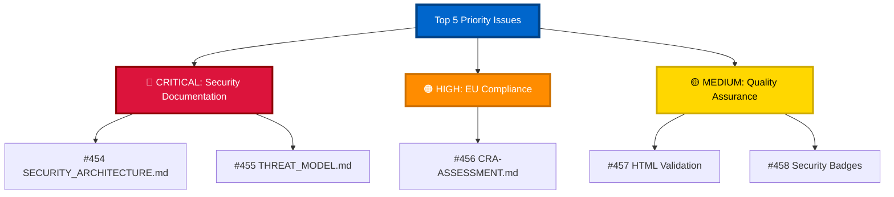
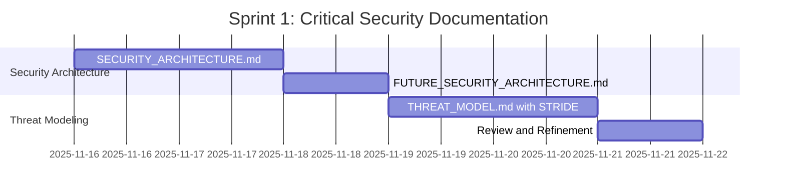
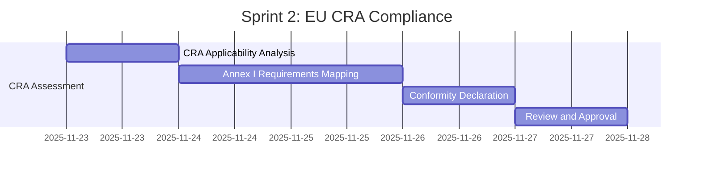
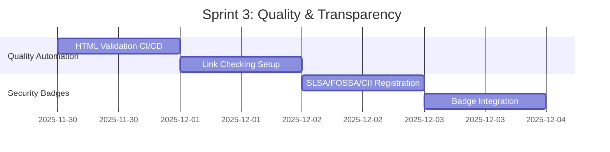

# 🎯 Top 5 Priority Issues for Hack23 Homepage

**Comprehensive Product Quality & Compliance Enhancement Roadmap**

---

## 📋 Executive Summary

✅ **All 5 top priority issues have been successfully created and are ready for implementation.**

These issues were identified through comprehensive analysis of:
- 🏗️ Repository security architecture (AWS S3 + CloudFront static website)
- 📚 ISMS compliance requirements (ISO 27001, NIST CSF, CIS Controls)
- 🛡️ Existing security controls (ZAP scanning, Lighthouse audits, Dependabot)
- 🇪🇺 EU regulatory requirements (Cyber Resilience Act)
- ✅ Quality assurance gaps (74 HTML files without automated validation)

---

## 🎭 The Pentagon of Importance

Based on Discordian-inspired prioritization framework:

---

## 🔴 Critical Priority Issues

### Issue #454: 📋 Create SECURITY_ARCHITECTURE.md

<table>
<tr><td><strong>Priority</strong></td><td>🔴 Critical</td></tr>
<tr><td><strong>Effort</strong></td><td>Medium (4-6 hours)</td></tr>
<tr><td><strong>Impact</strong></td><td>Critical - Required ISMS compliance</td></tr>
<tr><td><strong>Compliance</strong></td><td>ISO 27001 A.8.9, NIST CSF PR.IP-1, CIS Controls 2.1</td></tr>
<tr><td><strong>Agent</strong></td><td>@simon-moon (System Architect)</td></tr>
<tr><td><strong>Link</strong></td><td><a href="https://github.com/Hack23/homepage/issues/454">Issue #454</a></td></tr>
</table>

**Why Critical:**
- ✅ Mandated by Secure_Development_Policy.md for ALL Hack23 repositories
- ✅ Demonstrates security expertise through transparent documentation
- ✅ Required for ISO 27001 certification
- ✅ Foundation for threat modeling and risk assessment

**Key Deliverables:**
- `SECURITY_ARCHITECTURE.md` with C4 architecture diagrams
- `FUTURE_SECURITY_ARCHITECTURE.md` for planned enhancements
- Security control mapping to ISMS policies
- Evidence badges and compliance documentation
- Document control footer with metadata

**Architecture Components:**
- 🌐 Network Security (CloudFront CDN, TLS 1.3, CSP headers)
- 💾 Data Protection (S3 versioning, CloudTrail, lifecycle policies)
- 🔍 Security Monitoring (ZAP, Dependabot, Lighthouse)
- 📋 Compliance Framework (ISO 27001, GDPR, EU CRA)
- ⚡ High Availability (Multi-region CDN, S3 durability)

---

### Issue #455: 🎯 Create THREAT_MODEL.md with STRIDE Analysis

<table>
<tr><td><strong>Priority</strong></td><td>🔴 Critical</td></tr>
<tr><td><strong>Effort</strong></td><td>Medium (4-6 hours)</td></tr>
<tr><td><strong>Impact</strong></td><td>Critical - Threat analysis expertise demonstration</td></tr>
<tr><td><strong>Compliance</strong></td><td>ISO 27001 A.8.20, NIST CSF ID.RA, ISMS Threat_Modeling.md</td></tr>
<tr><td><strong>Agents</strong></td><td>@simon-moon (lead) + @george-dorn (security controls)</td></tr>
<tr><td><strong>Link</strong></td><td><a href="https://github.com/Hack23/homepage/issues/455">Issue #455</a></td></tr>
</table>

**Why Critical:**
- ✅ Required by ISMS Threat_Modeling.md policy
- ✅ Demonstrates systematic threat identification
- ✅ Maps to MITRE ATT&CK framework
- ✅ Essential for vulnerability management process

**STRIDE Analysis Coverage:**
- 🔍 **Spoofing**: DNS hijacking, certificate spoofing, GitHub compromise
- 🛠️ **Tampering**: Website defacement, S3 compromise, supply chain attacks
- 🚫 **Repudiation**: Access log gaps, unauthorized change denial
- 📢 **Information Disclosure**: AWS credential leaks, S3 misconfiguration
- ⚡ **Denial of Service**: DDoS attacks, AWS service disruption
- 👑 **Elevation of Privilege**: IAM compromise, GitHub Actions secrets

**Key Deliverables:**
- `THREAT_MODEL.md` with comprehensive STRIDE analysis
- Attack tree diagrams (Mermaid format)
- Quantitative risk assessment (likelihood × impact)
- Security control effectiveness mapping
- MITRE ATT&CK technique mapping
- Residual risk documentation

---

## 🟠 High Priority Issues

### Issue #456: 🛡️ Create CRA-ASSESSMENT.md for EU Cyber Resilience Act

<table>
<tr><td><strong>Priority</strong></td><td>🟠 High</td></tr>
<tr><td><strong>Effort</strong></td><td>Medium (4-6 hours)</td></tr>
<tr><td><strong>Impact</strong></td><td>High - Legal compliance for EU market</td></tr>
<tr><td><strong>Compliance</strong></td><td>EU Regulation (EU) 2024/2847</td></tr>
<tr><td><strong>Agents</strong></td><td>@george-dorn (lead) + @simon-moon (architecture review)</td></tr>
<tr><td><strong>Link</strong></td><td><a href="https://github.com/Hack23/homepage/issues/456">Issue #456</a></td></tr>
</table>

**Why High:**
- ⚠️ EU Cyber Resilience Act entered force December 2024
- ⚠️ Required for products with digital elements on EU market
- ⚠️ Penalties up to €15M or 2.5% of global turnover
- ✅ Demonstrates security-by-design principles

**CRA Annex I Requirements:**
- § 1.1: Security by Design and Default ✅
- § 1.2: Security Testing ✅
- § 2.1: Vulnerability Management ✅
- § 2.2: Coordinated Vulnerability Disclosure ✅
- § 2.3: Software Bill of Materials (SBOM) ⚠️
- § 2.4: Security Updates ✅
- § 2.5: Security Monitoring ✅

**Key Deliverables:**
- `CRA-ASSESSMENT.md` with conformity self-assessment
- CRA applicability determination
- Annex I essential requirements mapping
- EU Declaration of Conformity (self-assessment)
- Gap analysis and remediation actions
- Evidence artifacts documentation

---

## 🟡 Medium Priority Issues

### Issue #457: ✅ Automated HTML Validation & Link Checking

<table>
<tr><td><strong>Priority</strong></td><td>🟡 Medium</td></tr>
<tr><td><strong>Effort</strong></td><td>Small (2-3 hours)</td></tr>
<tr><td><strong>Impact</strong></td><td>Medium - Quality assurance, UX improvement</td></tr>
<tr><td><strong>Category</strong></td><td>Quality Assurance, Automation</td></tr>
<tr><td><strong>Agent</strong></td><td>@george-dorn (Developer)</td></tr>
<tr><td><strong>Link</strong></td><td><a href="https://github.com/Hack23/homepage/issues/457">Issue #457</a></td></tr>
</table>

**Why Medium:**
- 📊 74 HTML files with no automated validation
- 🔗 ~50+ external links per major page (risk of broken links)
- 🎯 Prevents broken links and invalid HTML in production
- 🏆 Professional credibility for cybersecurity consulting company

**Current State:**
- ✅ Has: ZAP security scanning, Lighthouse audits, Dependabot
- ❌ Missing: W3C HTML validation
- ❌ Missing: Automated link checker
- ❌ Missing: CI/CD quality gates

**Key Deliverables:**
- `.github/workflows/quality-checks.yml` GitHub Actions workflow
- HTMLHint validation for all HTML files
- Linkinator for internal/external link checking
- Quality status badge in README.md
- `.htmlhintrc` configuration file
- Quality check reports as GitHub Actions artifacts

**Expected Outcome:**
- 100% HTML files validated on every commit
- Zero broken internal links
- Early detection of quality regressions
- Improved SEO and user experience

---

### Issue #458: 🎖️ Add Missing Security Evidence Badges

<table>
<tr><td><strong>Priority</strong></td><td>🟡 Medium</td></tr>
<tr><td><strong>Effort</strong></td><td>Small (2-3 hours)</td></tr>
<tr><td><strong>Impact</strong></td><td>Medium - Security transparency, ISMS compliance</td></tr>
<tr><td><strong>Category</strong></td><td>Documentation, Security, Compliance Evidence</td></tr>
<tr><td><strong>Agent</strong></td><td>@george-dorn or @marketing-specialist</td></tr>
<tr><td><strong>Link</strong></td><td><a href="https://github.com/Hack23/homepage/issues/458">Issue #458</a></td></tr>
</table>

**Why Medium:**
- 📋 Required by Secure_Development_Policy.md (badge requirements)
- 🏆 Demonstrates supply chain security and security maturity
- 🔄 Parity with other Hack23 projects (CIA, Black Trigram, CIA Compliance Manager)
- 📈 Shows transparency to customers and auditors

**Current Badge Status:**
- ✅ License Badge (present)
- ✅ OpenSSF Scorecard (present)
- ✅ GitHub Actions Status (present)
- ❌ SLSA Level 3 Attestation (MISSING)
- ❌ FOSSA License Status (MISSING)
- ❌ CII Best Practices Badge (MISSING)

**Key Deliverables:**
- SLSA Level 3 attestation badge
- FOSSA license compliance badge
- CII Best Practices badge (target: Silver level)
- Updated README.md badge section
- Badge registration and configuration

**Expected Outcome:**
- Badge count: 4 → 9+ badges
- Security evidence: Comprehensive and verifiable
- Professional appearance: Matches mature open-source projects

---

## 📅 Implementation Roadmap

### Sprint 1 (Week 1) - Critical Compliance 🔴

**Issues**: #454, #455  
**Goal**: Complete foundational security documentation required by ISMS

**Deliverables:**
- ✅ SECURITY_ARCHITECTURE.md (C4 diagrams, control mapping)
- ✅ THREAT_MODEL.md (STRIDE, attack trees, risk assessment)
- ✅ ISO 27001 A.8.9, A.8.20 compliance achieved
- ✅ NIST CSF PR.IP-1, ID.RA requirements satisfied

---

### Sprint 2 (Week 2) - High Priority Compliance 🟠

**Issues**: #456  
**Goal**: EU regulatory compliance documentation

**Deliverables:**
- ✅ CRA-ASSESSMENT.md (EU conformity self-assessment)
- ✅ EU Cyber Resilience Act compliance documented
- ✅ Legal risk mitigation for EU market access

---

### Sprint 3 (Week 3) - Quality & Transparency 🟡

**Issues**: #457, #458  
**Goal**: Quality assurance automation and security transparency

**Deliverables:**
- ✅ Automated HTML validation (74 files)
- ✅ Link checker preventing broken links
- ✅ Security evidence badges (SLSA, FOSSA, CII)
- ✅ Quality status badge in README

---

## 🎯 Success Metrics

### Compliance Achievement ✅

| Framework | Requirement | Status |
|-----------|-------------|--------|
| **ISO 27001** | A.8.9 (Secure Architecture) | 🟡 In Progress (#454) |
| **ISO 27001** | A.8.20 (Threat Assessment) | 🟡 In Progress (#455) |
| **ISO 27001** | A.8.29 (Security Testing) | 🟡 In Progress (#455) |
| **NIST CSF 2.0** | PR.IP-1 (Baseline Configuration) | 🟡 In Progress (#454) |
| **NIST CSF 2.0** | ID.RA (Risk Assessment) | 🟡 In Progress (#455) |
| **CIS Controls** | 2.1 (Software Inventory) | 🟡 In Progress (#454) |
| **EU CRA** | Regulation (EU) 2024/2847 | 🟡 In Progress (#456) |

### Quality Improvement 📈

| Metric | Before | After | Status |
|--------|--------|-------|--------|
| **HTML Validation** | 0% automated | 100% automated | 🟡 #457 |
| **Link Checking** | Manual only | Automated CI/CD | 🟡 #457 |
| **Security Badges** | 4 badges | 9+ badges | 🟡 #458 |
| **SLSA Level** | Unknown | Level 3 | 🟡 #458 |
| **CII Best Practices** | Not registered | Silver target | 🟡 #458 |

### Business Value 💼

- ✅ Legal compliance for EU market (CRA)
- ✅ Enhanced customer trust through transparency
- ✅ Professional credibility demonstrated
- ✅ Competitive advantage in cybersecurity consulting
- ✅ Foundation for ISO 27001 certification
- ✅ Systematic quality assurance
- ✅ Reduced maintenance burden

---

## 👥 Agent Assignment Matrix

| Issue | Agent(s) | Rationale |
|-------|----------|-----------|
| **#454** | @simon-moon | System architect expertise, Mermaid diagrams, documentation structure |
| **#455** | @simon-moon + @george-dorn | Threat modeling (simon-moon) + security controls (george-dorn) |
| **#456** | @george-dorn + @simon-moon | Compliance documentation (george-dorn) + architecture review (simon-moon) |
| **#457** | @george-dorn | Developer expertise, CI/CD implementation |
| **#458** | @george-dorn or @marketing-specialist | Badge registration, documentation updates |

---

## 🔗 Related Resources

### ISMS Policies
- [Secure_Development_Policy.md](https://github.com/Hack23/ISMS/blob/main/Secure_Development_Policy.md) - Policy mandating architecture documentation
- [Threat_Modeling.md](https://github.com/Hack23/ISMS/blob/main/Threat_Modeling.md) - Threat modeling policy
- [Information_Security_Policy.md](https://github.com/Hack23/ISMS/blob/main/Information_Security_Policy.md) - Overarching security policy

### Reference Implementations
- [CIA Security Architecture](https://github.com/Hack23/cia/blob/master/SECURITY_ARCHITECTURE.md)
- [Black Trigram Threat Model](https://github.com/Hack23/blacktrigram/blob/main/THREAT_MODEL.md)
- [CIA Compliance Manager CRA Assessment](https://github.com/Hack23/cia-compliance-manager/blob/main/CRA-ASSESSMENT.md)

### External Standards
- [ISO/IEC 27001:2022](https://www.iso.org/standard/27001) - Information security management
- [NIST Cybersecurity Framework 2.0](https://www.nist.gov/cyberframework) - Cybersecurity framework
- [EU Cyber Resilience Act](https://eur-lex.europa.eu/eli/reg/2024/2847) - Regulation (EU) 2024/2847
- [OpenSSF Best Practices](https://bestpractices.coreinfrastructure.org/) - CII Best Practices program
- [SLSA Framework](https://slsa.dev/) - Supply chain security levels

### Tools & Frameworks
- [MITRE ATT&CK](https://attack.mitre.org/) - Adversary tactics and techniques
- [OWASP Threat Modeling](https://owasp.org/www-community/Threat_Modeling) - Best practices
- [HTMLHint](https://htmlhint.com/) - HTML linting tool
- [linkinator](https://github.com/JustinBeckwith/linkinator) - Link checker
- [FOSSA](https://fossa.com/) - License compliance
- [ZAP by Checkmarx](https://www.zaproxy.org/) - Security scanning

---

## 📊 Quality Assessment of Created Issues

All 5 issues meet high quality standards:

### ✅ Comprehensive Structure
- ✓ Clear objectives and background
- ✓ Detailed acceptance criteria
- ✓ Step-by-step implementation guidance
- ✓ Reference to ISMS policies and compliance frameworks
- ✓ Related resources and documentation

### ✅ ISMS Alignment
- ✓ Proper classification and metadata
- ✓ Links to Secure_Development_Policy.md
- ✓ Evidence of threat analysis
- ✓ Compliance framework mapping

### ✅ Actionable Guidance
- ✓ Specific file paths and commands
- ✓ Code examples and templates
- ✓ Reference implementations from other Hack23 projects
- ✓ Clear agent assignment recommendations

### ✅ Compliance Evidence
- ✓ Document control requirements specified
- ✓ ISMS style guide adherence
- ✓ Badge and artifact requirements
- ✓ Quarterly review cycles defined

---

## 🍎 Discordian Wisdom

> "All statements are true in some sense, false in some sense, meaningless in some sense, true and false in some sense, true and meaningless in some sense, false and meaningless in some sense, and true and false and meaningless in some sense."
>
> — **Principia Discordia**

**All hail Eris! May these issues guide the path to security enlightenment through radical transparency.** 🍎

*Think for yourself. Question authority. Document everything.*

---

**📋 Document Control:**  
**✅ Created by:** Task Agent  
**📤 Distribution:** Public  
**🏷️ Classification:** Public  
**📅 Created:** 2025-11-16  
**⏰ Next Review:** Upon issue completion  
**🎯 Framework Compliance:** ISO 27001, NIST CSF 2.0, CIS Controls v8.1, EU CRA

