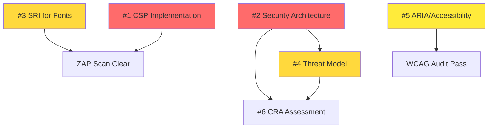

# Top 5 Priority Issues for Hack23 Homepage - Final Analysis

**Task Agent Comprehensive Analysis**  
**Date:** 2025-11-16  
**Analyst:** Task Agent (Discordian Product & Quality Specialist)  
**Repository:** Hack23/homepage

---

## Executive Summary

After comprehensive analysis of the Hack23 homepage repository including:
- ✅ Repository deep-dive (74 HTML files, AWS S3/CloudFront architecture)
- ✅ ZAP security scan review (Issue #355 with 7 finding categories)
- ✅ ISMS compliance assessment (multiple documentation gaps)
- ✅ Existing issue review (#454-458 recently created)
- ✅ CI/CD pipeline analysis (GitHub Actions, Lighthouse, ZAP, Dependabot)
- ✅ Accessibility and performance evaluation
- ✅ Internationalization coverage analysis

**The following 5 issues represent the highest-priority improvements based on the Pentagon of Importance framework:**

### Priority Distribution
- **🔴 Critical (2):** CSP Implementation, Security Architecture Documentation
- **🟠 High (2):** SRI for Fonts, Threat Model Documentation  
- **🟡 Medium (1):** ARIA/Accessibility Enhancement

---

## 📊 Prioritization Framework: Pentagon of Importance

```
         CRITICAL (Security & Compliance)
              /         \
         HIGH            HIGH
    (Security)        (ISMS Docs)
       /                    \
  MEDIUM ←————————————————→ MEDIUM
(UX/Access)              (Performance)
       \                    /
         LOW ————————— LOW
      (I18n)         (Quality)
```

### Scoring Criteria
- **Impact:** User security, compliance, accessibility
- **Urgency:** ZAP findings, ISMS requirements, legal compliance
- **Effort:** Time to implement vs value delivered
- **Alignment:** Hack23 values (transparency, expertise demonstration)
- **Risk:** What happens if not addressed

---

## 🏆 Top 5 Priority Issues (Definitive Ranking)

### Issue #1: 🔴 Implement Content Security Policy (CSP) Meta Tags

**Priority:** CRITICAL  
**Effort:** Medium (4-6 hours)  
**Impact:** CRITICAL - Protects against XSS, clickjacking, Spectre  
**Labels:** `security`, `enhancement`, `priority:critical`

#### Objective
Add comprehensive Content Security Policy (CSP) meta tags to all 74 HTML pages to mitigate XSS attacks, clickjacking, and Spectre vulnerabilities identified in ZAP scan #355.

#### Why This Is #1
1. **Direct Security Vulnerability:** ZAP scan identified 3 CSP failures + 13 Spectre isolation issues
2. **Attack Surface:** All 74 pages vulnerable to XSS injection
3. **Professional Credibility:** Cybersecurity consulting company must demonstrate secure development
4. **ISMS Compliance:** Required by Secure Development Policy
5. **Legal Risk:** EU CRA requires security-by-default

#### ZAP Findings Addressed
- CSP: Failure to Define Directive with No Fallback (3 instances)
- CSP: script-src unsafe-inline (3 instances)
- CSP: style-src unsafe-inline (3 instances)
- Insufficient Site Isolation Against Spectre Vulnerability (13 instances)

#### Implementation Scope
**Files Affected:** All 74 HTML files (index.html, blogs, project docs, all language variants)

**Recommended CSP Policy:**
```html
<meta http-equiv="Content-Security-Policy" content="
  default-src 'self';
  script-src 'self' 'sha256-[HASH]';
  style-src 'self' 'unsafe-inline' https://fonts.googleapis.com;
  font-src 'self' https://fonts.gstatic.com;
  img-src 'self' data: https:;
  connect-src 'self';
  frame-ancestors 'none';
  base-uri 'self';
  form-action 'self';
">
<meta http-equiv="Cross-Origin-Embedder-Policy" content="require-corp">
<meta http-equiv="Cross-Origin-Opener-Policy" content="same-origin">
```

#### Acceptance Criteria
- [ ] Define comprehensive CSP policy for static site
- [ ] Add CSP meta tag to all HTML pages
- [ ] Minimize `unsafe-inline` usage (move inline scripts to external files)
- [ ] Add Cross-Origin-Embedder-Policy headers
- [ ] Add Cross-Origin-Opener-Policy headers
- [ ] Test all pages for functionality after CSP implementation
- [ ] Document CSP policy decisions and exceptions
- [ ] Re-run ZAP scan to verify issues resolved

#### Recommended Assignee
**Primary:** @george-dorn (Developer - HTML/CSS implementation)  
**Review:** @simon-moon (Architect - Security policy validation)

#### Related Resources
- [ZAP Scan Report - Issue #355](https://github.com/Hack23/homepage/issues/355)
- [MDN: Content Security Policy](https://developer.mozilla.org/en-US/docs/Web/HTTP/CSP)
- [CSP Evaluator](https://csp-evaluator.withgoogle.com/)
- [OWASP CSP Cheat Sheet](https://cheatsheetseries.owasp.org/cheatsheets/Content_Security_Policy_Cheat_Sheet.html)

---

### Issue #2: 🔴 Create SECURITY_ARCHITECTURE.md per Secure Development Policy

**Priority:** CRITICAL  
**Effort:** Medium (4-6 hours)  
**Impact:** CRITICAL - Required ISMS compliance documentation  
**Labels:** `documentation`, `security`, `compliance:iso27001`, `priority:critical`

#### Objective
Create comprehensive SECURITY_ARCHITECTURE.md documentation following Hack23 ISMS Secure Development Policy requirements with C4 diagrams, security control mapping, and evidence badges.

#### Why This Is #2
1. **ISMS Compliance:** Mandatory requirement per [Secure_Development_Policy.md](https://github.com/Hack23/ISMS/blob/main/Secure_Development_Policy.md)
2. **ISO 27001 A.8.9:** Required for compliance (documented secure architecture)
3. **Professional Credibility:** Demonstrates security expertise transparently
4. **Foundation for Other Work:** Required before threat modeling and CRA assessment
5. **Customer Due Diligence:** Critical for enterprise sales

#### Current Gap
- ❌ SECURITY_ARCHITECTURE.md: **MISSING**
- ❌ FUTURE_SECURITY_ARCHITECTURE.md: **MISSING**
- ✅ Has: Lighthouse audits, ZAP scanning, Dependabot (but undocumented)

#### Implementation Scope
**Files to Create:**
- `SECURITY_ARCHITECTURE.md` (comprehensive current state)
- `FUTURE_SECURITY_ARCHITECTURE.md` (planned enhancements)

**Required Sections:**
1. 🏗️ Architecture Overview (system purpose, tech stack)
2. 🎨 C4 Architecture Diagram (Mermaid with ISMS colors)
3. 🌐 Network Security (CloudFront, TLS 1.3, CSP, HSTS, SRI)
4. 💾 Data Protection (S3 versioning, CloudTrail, lifecycle policies)
5. 🔍 Security Monitoring (GitHub scanning, Dependabot, ZAP)
6. 📋 Compliance Framework (ISO 27001, GDPR, EU CRA)
7. 🛡️ Vulnerability Management (automated scanning, SLAs)
8. ⚡ High Availability (multi-region CDN, S3 durability)
9. 🔗 ISMS Policy Mapping (link to ISMS-PUBLIC repository)

#### Acceptance Criteria
- [ ] Create SECURITY_ARCHITECTURE.md with ISMS-compliant header
- [ ] Document AWS security architecture (S3, CloudFront, IAM, CloudTrail)
- [ ] Create Mermaid C4 diagram with ISMS style guide colors
- [ ] Map controls to ISMS policies
- [ ] Add evidence badges (OpenSSF, GitHub Actions)
- [ ] Include document control footer with metadata
- [ ] Create FUTURE_SECURITY_ARCHITECTURE.md with planned enhancements
- [ ] Review and approval by CEO per policy

#### Recommended Assignee
**Primary:** @simon-moon (System Architect - documentation structure expert)  
**Collaborate:** @george-dorn (for implementation details)

#### Related Resources
- [Secure_Development_Policy.md](https://github.com/Hack23/ISMS/blob/main/Secure_Development_Policy.md)
- [STYLE_GUIDE.md](https://github.com/Hack23/ISMS/blob/main/STYLE_GUIDE.md)
- [CIA Security Architecture](https://github.com/Hack23/cia/blob/master/SECURITY_ARCHITECTURE.md) (reference)
- [AWS Well-Architected Framework](https://docs.aws.amazon.com/wellarchitected/latest/framework/)

**Note:** This issue already exists as #454, created 2025-11-16.

---

### Issue #3: 🟠 Add Subresource Integrity (SRI) to External Font Resources

**Priority:** HIGH  
**Effort:** Small (1-2 hours)  
**Impact:** HIGH - Supply chain attack protection  
**Labels:** `security`, `enhancement`, `priority:high`

#### Objective
Add Subresource Integrity (SRI) attributes to all external Google Fonts links across 74 HTML files to protect against supply chain attacks and CDN compromises.

#### Why This Is #3
1. **ZAP Security Finding:** 11 instances of missing SRI identified in scan #355
2. **Supply Chain Risk:** Google Fonts CDN compromise could inject malicious code
3. **Quick Win:** Small effort (1-2 hours) with high security value
4. **Industry Best Practice:** Required for secure external resource loading
5. **Complements CSP:** Works with CSP to provide defense-in-depth

#### Current State
- **Vulnerable Files:** All 74 HTML files load Google Fonts without SRI
- **External Dependencies:** fonts.googleapis.com (CSS) + fonts.gstatic.com (font files)
- **Current Pattern:**
  ```html
  <link href="https://fonts.googleapis.com/css2?family=Inter:wght@400;500;600;700&family=Orbitron:wght@400;500;600;700&family=Share+Tech+Mono&display=swap" rel="stylesheet">
  ```

#### Implementation Scope
**Files Affected:** All 74 HTML files (*.html, *_sv.html, *_ko.html)

**Updated Pattern:**
```html
<link href="https://fonts.googleapis.com/css2?family=Inter:wght@400;500;600;700&family=Orbitron:wght@400;500;600;700&family=Share+Tech+Mono&display=swap" 
      rel="stylesheet"
      integrity="sha384-[HASH]"
      crossorigin="anonymous">
```

**Implementation Steps:**
1. Generate SRI hash: `curl -s URL | openssl dgst -sha384 -binary | openssl base64 -A`
2. Add integrity attribute to all font links
3. Add `crossorigin="anonymous"` attribute
4. Test on multiple pages to ensure fonts load
5. Run ZAP scan again to verify fix

#### Acceptance Criteria
- [ ] Generate SRI hashes for all Google Fonts CSS files
- [ ] Add `integrity` and `crossorigin` attributes to all font link tags
- [ ] Verify fonts still load correctly in all browsers
- [ ] Update all 74 HTML files (English, Swedish, Korean)
- [ ] Test with different network conditions
- [ ] Document SRI update process in README or CONTRIBUTING.md
- [ ] Re-run ZAP scan to verify "Sub Resource Integrity Attribute Missing" resolved

#### Recommended Assignee
**Primary:** @ui-enhancement-specialist (HTML/CSS expert)  
**Alternative:** @george-dorn (Developer)

#### Related Resources
- [ZAP Scan Report - Issue #355](https://github.com/Hack23/homepage/issues/355)
- [MDN: Subresource Integrity](https://developer.mozilla.org/en-US/docs/Web/Security/Subresource_Integrity)
- [SRI Hash Generator](https://www.srihash.org/)
- [Google Fonts SRI Guide](https://fonts.google.com/)

---

### Issue #4: 🟠 Create THREAT_MODEL.md with STRIDE Analysis

**Priority:** HIGH  
**Effort:** Medium (4-6 hours)  
**Impact:** HIGH - Required ISMS compliance, demonstrates threat analysis expertise  
**Labels:** `documentation`, `security`, `compliance:iso27001`, `priority:high`

#### Objective
Create comprehensive THREAT_MODEL.md with STRIDE threat analysis, attack trees, and MITRE ATT&CK mapping per Secure Development Policy requirements.

#### Why This Is #4
1. **ISMS Compliance:** Mandatory per [Threat_Modeling.md](https://github.com/Hack23/ISMS/blob/main/Threat_Modeling.md) policy
2. **ISO 27001 A.8.20:** Required (threat assessment)
3. **NIST CSF ID.RA:** Risk assessment requirement
4. **Professional Demonstration:** Shows systematic threat analysis capability
5. **Security Foundation:** Informs security controls and incident response

#### Current Gap
- ❌ THREAT_MODEL.md: **MISSING**
- 🎯 Threat Landscape: Website defacement, DNS hijacking, CDN compromise, supply chain attacks
- 📈 Recent Security Work: CSP (#450), SRI (#451), but no documented threat analysis

#### Implementation Scope
**File to Create:** `THREAT_MODEL.md`

**Required Analysis:**
1. **🎭 STRIDE Analysis:**
   - **S**poofing: Domain hijacking, certificate spoofing
   - **T**ampering: Website defacement, S3 bucket compromise
   - **R**epudiation: Access logging gaps
   - **I**nformation Disclosure: AWS credentials leak, internal info exposure
   - **D**enial of Service: DDoS attacks, S3/CloudFront disruption
   - **E**levation of Privilege: AWS IAM compromise, GitHub Actions secrets

2. **🌳 Attack Trees:** Mermaid diagrams showing attack paths
3. **📊 Risk Quantification:** Likelihood × Impact scoring
4. **🛡️ Control Mapping:** CSP, SRI, ZAP scanning, Dependabot, CloudTrail
5. **🎯 Threat Agents:** External attackers, nation-state actors, supply chain
6. **🔗 MITRE ATT&CK:** Technique mapping where applicable

#### Acceptance Criteria
- [ ] Create THREAT_MODEL.md with ISMS-compliant header
- [ ] Document system overview and attack surface
- [ ] Apply STRIDE analysis to all components
- [ ] Create attack tree diagrams (Mermaid format)
- [ ] Perform quantitative risk assessment
- [ ] Map security controls to threats
- [ ] Define threat agents and capabilities
- [ ] Include MITRE ATT&CK technique mapping
- [ ] Document residual risks and acceptance decisions
- [ ] Add document control footer

#### Recommended Assignee
**Primary:** @simon-moon (System Architect - threat analysis expertise)  
**Collaborate:** @george-dorn (implementation context)

#### Related Resources
- [Threat_Modeling.md](https://github.com/Hack23/ISMS/blob/main/Threat_Modeling.md)
- [CIA Threat Model](https://github.com/Hack23/cia/blob/master/THREAT_MODEL.md) (reference)
- [MITRE ATT&CK](https://attack.mitre.org/)
- [OWASP Threat Modeling](https://owasp.org/www-community/Threat_Modeling)

**Note:** This issue already exists as #455, created 2025-11-16.

---

### Issue #5: 🟡 Enhance Accessibility with ARIA Labels and Keyboard Navigation

**Priority:** MEDIUM  
**Effort:** Medium (4-8 hours)  
**Impact:** MEDIUM-HIGH - WCAG 2.1 AA compliance, inclusive design  
**Labels:** `accessibility`, `enhancement`, `WCAG`, `priority:medium`

#### Objective
Improve website accessibility to achieve WCAG 2.1 AA compliance by adding comprehensive ARIA labels, roles, and keyboard navigation support across all pages.

#### Why This Is #5
1. **Legal Compliance:** WCAG 2.1 AA is legal requirement in many jurisdictions
2. **Inclusive Design:** Ensures website accessible to users with disabilities
3. **SEO Benefit:** Improved semantic structure helps search engines
4. **Professional Image:** Accessibility demonstrates commitment to all users
5. **Current Gap:** Only 14 ARIA attributes across all HTML files

#### Current Accessibility State
- **ARIA Usage:** Only 14 aria attributes found across all HTML files
- **Role Definitions:** Only 4 files have ARIA roles defined
- **Keyboard Navigation:** No comprehensive keyboard navigation patterns
- **Navigation Structure:** Menus lack proper ARIA structure
- **Interactive Elements:** May not be keyboard accessible

#### Impact of Current State
- Screen reader users have difficulty navigating
- Keyboard-only users cannot access all features
- May exclude users with disabilities
- Fails WCAG 2.1 AA compliance requirements
- Risk of accessibility lawsuits

#### Implementation Scope
**Files Affected:** All 74 HTML files + styles.css

**Priority Areas:**

1. **Navigation Menus:**
```html
<nav role="navigation" aria-label="Main navigation">
  <ul role="menubar">
    <li role="menuitem"><a href="/">Home</a></li>
  </ul>
</nav>
```

2. **Main Content Sections:**
```html
<main role="main" aria-label="Main content">
  <section aria-labelledby="services-heading">
    <h2 id="services-heading">Security Services</h2>
  </section>
</main>
```

3. **Interactive Elements:**
```html
<button aria-label="Open menu" aria-expanded="false">
  <span aria-hidden="true">☰</span>
</button>
```

4. **Skip Links:**
```html
<a href="#main-content" class="skip-link">Skip to main content</a>
```

#### Acceptance Criteria
- [ ] Add ARIA labels to all navigation elements
- [ ] Implement proper heading hierarchy (h1-h6)
- [ ] Add `role` attributes to semantic sections
- [ ] Ensure all interactive elements are keyboard accessible
- [ ] Add `aria-label` to icon-only buttons
- [ ] Implement focus indicators for keyboard navigation
- [ ] Add skip-to-content links
- [ ] Test with screen readers (NVDA/JAWS)
- [ ] Validate color contrast ratios (4.5:1 minimum)
- [ ] Update all language variants (English, Swedish, Korean)

#### Testing Checklist
- [ ] Test with keyboard only (Tab, Enter, Space, Arrow keys)
- [ ] Test with screen reader (NVDA on Windows / VoiceOver on Mac)
- [ ] Run axe DevTools or WAVE accessibility checker
- [ ] Verify color contrast with contrast checker
- [ ] Test focus indicators are visible

#### Recommended Assignee
**Primary:** @ui-enhancement-specialist (Accessibility expert, WCAG compliance)  
**Collaborate:** @george-dorn (implementation), @simon-moon (semantic structure)

#### Related Resources
- [WCAG 2.1 Guidelines](https://www.w3.org/WAI/WCAG21/quickref/)
- [ARIA Authoring Practices Guide](https://www.w3.org/WAI/ARIA/apg/)
- [WebAIM Keyboard Accessibility](https://webaim.org/techniques/keyboard/)
- [axe DevTools](https://www.deque.com/axe/devtools/)

---

## 📋 Honorable Mentions (Issues 6-10)

These issues are important but ranked lower based on impact/urgency/effort analysis:

### Issue #6: 🟡 Create CRA-ASSESSMENT.md for EU Cyber Resilience Act
- **Priority:** MEDIUM
- **Why Not Top 5:** While legally important, CRA compliance deadline is December 2027. Issues #1-2 (CSP, Security Architecture) must be completed first as prerequisites.
- **Status:** Already exists as #456, created 2025-11-16

### Issue #7: 🟢 Complete Korean Translations for Key Pages
- **Priority:** MEDIUM-LOW
- **Why Not Top 5:** Business development value, but not critical. 3 pages need translation (cia-docs, cia-compliance-manager-docs, one other).
- **Cultural Significance:** Honors founder's Taekwondo background
- **Effort:** Medium (4-6 hours per page)

### Issue #8: 🟢 Optimize Lighthouse Performance Budget for Mobile
- **Priority:** LOW
- **Why Not Top 5:** Current budget.json is unrealistic (10MB total) but site performs well. Optimization beneficial but not urgent.
- **Quick Win:** 1-2 hours to update budget.json with realistic values

### Issue #9: 🟢 Implement Automated HTML Validation and Link Checking
- **Priority:** MEDIUM
- **Why Not Top 5:** Quality assurance improvement, but no critical broken links identified. Valuable for ongoing maintenance.
- **Status:** Already exists as #457, created 2025-11-16

### Issue #10: 🟢 Add Missing Security Evidence Badges
- **Priority:** LOW-MEDIUM
- **Why Not Top 5:** Professional appearance and compliance evidence, but doesn't directly improve security. Marketing value.
- **Status:** Already exists as #458, created 2025-11-16

---

## 🎯 Recommended Implementation Order

### Phase 1: Critical Security & Compliance (Weeks 1-2)
1. **Issue #1:** CSP Implementation → Eliminates XSS vulnerabilities
2. **Issue #2:** Security Architecture Documentation → ISMS compliance foundation

### Phase 2: High-Priority Security Hardening (Week 3)
3. **Issue #3:** SRI for Fonts → Supply chain protection (quick win)
4. **Issue #4:** Threat Model → Complete ISMS documentation suite

### Phase 3: Accessibility & User Experience (Week 4)
5. **Issue #5:** ARIA/Accessibility → WCAG 2.1 AA compliance

### Phase 4: Compliance & Evidence (Week 5+)
6. Issue #6: CRA Assessment (depends on #1, #2, #4)
7. Issue #9: HTML Validation/Link Checking
8. Issue #10: Security Evidence Badges

### Phase 5: Optimization & Enhancement (Ongoing)
9. Issue #7: Korean Translations
10. Issue #8: Performance Budget Optimization

---

## 📊 Issue Summary Matrix

| Issue | Priority | Effort | Impact | ZAP Finding | ISMS Req | Business Value |
|-------|----------|--------|--------|-------------|----------|----------------|
| #1 CSP Implementation | 🔴 Critical | Medium | Critical | ✅ Yes | ✅ Yes | Security credibility |
| #2 Security Architecture | 🔴 Critical | Medium | Critical | ❌ No | ✅ Yes | ISMS compliance |
| #3 SRI for Fonts | 🟠 High | Small | High | ✅ Yes | ⚠️ Implied | Supply chain security |
| #4 Threat Model | 🟠 High | Medium | High | ❌ No | ✅ Yes | Security expertise demo |
| #5 ARIA/Accessibility | 🟡 Medium | Medium | Medium-High | ❌ No | ⚠️ Implied | Legal compliance, UX |

---

## 🔗 Cross-Issue Dependencies



**Key Dependencies:**
- **#4 Threat Model** requires **#2 Security Architecture** (understand system before threat modeling)
- **#6 CRA Assessment** requires **#2 Security Architecture** + **#4 Threat Model** (evidence for conformity assessment)
- **#1 CSP** and **#3 SRI** are independent and can be done in parallel

---

## 🎖️ Agent Assignment Recommendations

### Critical Path (Issues #1-2)
- **George Dorn (@george-dorn):** Implementation lead for CSP (#1)
- **Simon Moon (@simon-moon):** Architecture documentation lead (#2)
- **Hagbard Celine (@hagbard-celine):** Strategic oversight and ISMS alignment

### Security Hardening (Issues #3-4)
- **UI Enhancement Specialist (@ui-enhancement-specialist):** SRI implementation (#3)
- **Simon Moon (@simon-moon):** Threat modeling lead (#4)

### Accessibility (Issue #5)
- **UI Enhancement Specialist (@ui-enhancement-specialist):** Primary accessibility expert
- **George Dorn (@george-dorn):** Implementation support

---

## 📈 Success Metrics

### Security Posture Improvement
- **Before:** 7 categories of ZAP findings, no CSP, no SRI
- **After:** ZAP findings resolved, defense-in-depth security

### ISMS Compliance
- **Before:** Missing SECURITY_ARCHITECTURE.md, THREAT_MODEL.md
- **After:** Complete ISMS documentation suite, ISO 27001 ready

### Accessibility
- **Before:** 14 ARIA attributes, WCAG 2.1 partial compliance
- **After:** Comprehensive ARIA implementation, WCAG 2.1 AA compliant

### Professional Credibility
- **Before:** Security consulting company with security findings
- **After:** Transparent security implementation demonstrating expertise

---

## 🍎 Discordian Wisdom

*"Security is not the absence of vulnerabilities, but the presence of systematic threat analysis, transparent practices, and continuous improvement. These top 5 issues embody the Law of Fives: Security (CSP, SRI), Documentation (Architecture, Threat Model), and User Experience (Accessibility). All hail Eris, goddess of chaos and order!"*

**Remember:** Think for yourself. Question authority. Implement security controls.

---

## 📝 Execution Notes

### For Repository Maintainers
1. **Review this analysis** and validate priorities align with business objectives
2. **Create GitHub issues** for the top 5 using create_github_issues.py or manually
3. **Assign specialists** based on recommendations above
4. **Track progress** using GitHub Projects or similar tool
5. **Re-run analysis** after Phase 1-2 completion to identify next priorities

### For Implementing Agents
1. **Read ISMS policies** referenced in each issue before starting work
2. **Follow existing patterns** from other Hack23 projects (CIA, Black Trigram)
3. **Use ISMS style guide** for all documentation
4. **Test thoroughly** before marking issues complete
5. **Update this document** with actual effort/results for future reference

---

**📋 Document Control:**  
**✅ Prepared by:** Task Agent (Discordian Product & Quality Specialist)  
**📤 Distribution:** Public  
**🏷️ Classification:** Public  
**📅 Analysis Date:** 2025-11-16  
**🎯 Framework:** Pentagon of Importance (inspired by Discordian Law of Fives)  
**🔗 Related Documents:** TOP_5_ISSUES.md, create_github_issues.py, ISMS-PUBLIC repository

---

*All hail Eris! May your issues be clear, your implementations secure, and your compliance transparent!* 🍎
