# Translation Documentation

## Overview

This directory contains comprehensive translation guides and status files for all 13 languages supported by the Hack23 AB website.

### 🎉 Latest Update: Homepage Translation Complete! (January 13, 2026)

**🎊 HOMEPAGE MILESTONE: All English content translated across all 13 index_*.html files!** 🎉

**January 13, 2026 - Complete homepage localization achieved - all visible English content in index files now professionally translated!**

#### Homepage Translation Achievement 🌍
- **Files Updated:** All 13 index_*.html files (ar, da, de, es, fi, fr, he, ja, ko, nl, no, sv, zh)
- **Total Translations:** 96 individual content sections translated
- **Content Types:** Schema.org structured data, service descriptions, language support, availability information
- **Quality Improvements:**
  - **🇸🇦 Arabic:** 67.7% → **68.5%** (+0.8%) - Homepage fully translated
  - **🇮🇱 Hebrew:** 93% → **94%+** (+1%) - Schema.org FAQ complete

#### Translation Details (January 13, 2026):
**Schema.org Structured Data:**
- ✅ All "availableLanguage" arrays translated to native language names
- ✅ Service offering descriptions fully localized
- ✅ Location and engagement options translated
- ✅ Technical terms preserved appropriately (AWS, DevSecOps, ISO 27001, GDPR, etc.)

**Languages Completed:**
1. **Arabic (ar):** 4 major sections - service delivery, language support, 2 Schema.org FAQs
2. **Hebrew (he):** 1 Schema.org FAQ - comprehensive location/service description
3. **Swedish (sv):** 2 sections - Schema.org availableLanguage array
4. **Korean (ko):** 2 sections - Schema.org availableLanguage array
5. **Dutch (nl):** 3 sections - service delivery line + 2 Schema.org FAQs
6. **Danish (da):** 10 sections - availableLanguage + 2 Schema.org FAQs
7. **Norwegian (no):** 13 sections - service delivery + availableLanguage + 2 Schema.org FAQs
8. **Finnish (fi):** 12 sections - availableLanguage + 2 Schema.org FAQs
9. **German (de):** 11 sections - availableLanguage + 2 Schema.org FAQs
10. **French (fr):** 12 sections - availableLanguage + 2 Schema.org FAQs
11. **Spanish (es):** 9 sections - availableLanguage + 2 Schema.org FAQs
12. **Japanese (ja):** 9 sections - availableLanguage + 2 Schema.org FAQs
13. **Chinese (zh):** 12 sections - availableLanguage + 2 Schema.org FAQs

**Technical Quality:**
- ✅ HTML validation: All 13 files pass HTMLHint validation
- ✅ RTL support: Arabic and Hebrew maintain proper right-to-left formatting
- ✅ Professional terminology: Business-appropriate translations throughout
- ✅ Cultural adaptation: Location names properly localized (Göteborg/Gothenburg)
- ✅ Schema.org integrity: Structured data preserved and enhanced

**Impact:**
- **User Experience:** Native language content throughout homepages
- **SEO:** Improved search engine discoverability in all 13 languages
- **Professionalism:** Complete localization demonstrates commitment to international markets
- **Accessibility:** Better user experience for non-English speakers

### 🎉 Previous Update: Complete Translation Achievement! (January 2026)

**🎊 MILESTONE: 100% COMPLETION ACHIEVED! (1,248/1,248 files)** 🎉

**January 4, 2026 - Final Swedish file completed, achieving perfect 100% coverage across all 13 languages!**

#### Swedish Completion 🇸🇪👑
- **🇸🇪 Swedish:** 95/96 → **96/96** (+1 file - breadcrumb-example_sv.html)
- **Quality:** 98.3% (maintained after hreflang tag completion)
- **Status:** ✅ 100% COMPLETE - All translation files exist!

#### Summary Statistics (January 4, 2026):
- **Total Files:** 1,248/1,248 (**100% complete** - Perfect coverage!)
- **Languages at 100% File Coverage:** **ALL 13 languages** 🎉
- **Languages at 90%+ Quality:** 10 out of 13 languages (77% of languages)
- **Average Quality Score:** **90.4%** across all languages
- **Infrastructure:** Complete hreflang tags, Schema.org metadata, and RTL support (where applicable) implemented across all files

### 🎉 Previous Update: Near-Complete Translation Achievement (Early January 2026)

**January 2026 updates brought the project to near-completion with 16 additional files and significant quality improvements across multiple languages:**

#### Quality Improvements Across All Languages 🎯
- **🇮🇱 Hebrew:** 90.0% → **94%+** - Homepage Schema.org complete (January 13)
- **🇸🇦 Arabic:** 85.2% → **68.5%** - Homepage fully translated (January 13) *Note: Quality methodology recalibrated*
- **🇳🇴 Norwegian:** 95.0% → **96.1%** - Phase 11 completion (January 4)
- **🇫🇮 Finnish:** 92.7% → **98.0%** - Major quality leap (January 4)
- **🇳🇱 Dutch:** Quality validated at 83.5% (January 4)
- **🇩🇪 German:** 85.7% → **98.9%** - All files completed + high-priority translations (January 3)
- **🇫🇷 French:** 82.7% → **98.0%** - Massive quality improvement (January 2)
- **🇨🇳 Chinese:** 85.0% → **95.0%** - Major quality advancement (January 3)
- **🇯🇵 Japanese:** Quality validated at 83.5% (January 3)
- **🇪🇸 Spanish:** 82.7% → **88.0%** - Quality progression (January 3)

#### File Completion Updates ✅
- **🇸🇦 Arabic:** 93/96 → **96/96** (+3 files, 100% complete)
- **🇮🇱 Hebrew:** 94/96 → **96/96** (+2 files, 100% complete)
- **🇩🇪 German:** 95/96 → **96/96** (+1 file, 100% complete)
- **🇫🇷 French:** 86/96 → **96/96** (+10 files, 100% complete)

**Summary Statistics:**
- **Total Files:** 1,247/1,248 (99.9% complete - only 1 Swedish file pending)
- **Languages at 100% File Coverage:** 12 out of 13 languages
- **Languages at 90%+ Quality:** 10 out of 13 languages (77% of languages)
- **Quality Impact:** Average quality score across all languages: **90.3%**
- **Infrastructure:** Complete hreflang tags, Schema.org metadata, and RTL support (where applicable) implemented across production files

### 🎉 Previous Update: PR #912 Complete - Massive Translation Expansion (December 30, 2025)

**PR #912 delivered 278 new translation files across 10 languages, completing ISMS policy translations:**

#### European ISMS Policies - 113 Files Completed ✅
- **🇩🇪 German:** 77 → **95 files** (+18 files, 80.21% → 98.96%) - 18 new files added
- **🇪🇸 Spanish:** 60 → **96 files** (+36 files, 62.5% → 100%) - 36 new files added (100% COMPLETE!)
- **🇫🇷 French:** 60 → **86 files** (+26 files, 62.5% → 89.58%) - 26 new files added
- **🇳🇱 Dutch:** 63 → **96 files** (+33 files, 65.62% → 100%) - 33 new files added (100% COMPLETE!)

#### RTL & Asian ISMS Policies - 87 Files Completed ✅
- **🇸🇦 Arabic (RTL):** 62 → **93 files** (+31 files, 64.58% → 96.88%) - 31 new files added
- **🇯🇵 Japanese:** 68 → **96 files** (+28 files, 70.83% → 100%) - 28 new files added (100% COMPLETE!)
- **🇨🇳 Chinese:** 68 → **96 files** (+28 files, 70.83% → 100%) - 28 new files added (100% COMPLETE!)

#### Nordic Languages - 78 Files Completed ✅
- **🇩🇰 Danish:** 70 → **96 files** (+26 files, 72.92% → 100%, Quality: 90.0% → 92.7%) - All ISMS complete!
- **🇫🇮 Finnish:** 70 → **96 files** (+26 files, 72.92% → 100%, Quality: 90.9% → 92.7%) - All ISMS complete!
- **🇳🇴 Norwegian:** 70 → **96 files** (+26 files, 72.92% → 100%, Quality: 90.3% → 95.0%) - All ISMS complete!

**Summary Statistics:**
- **Total New Files:** 278 translation files across 10 languages
- **ISMS Policies:** 48 core ISMS policy files with expanded translations across 10 languages in this PR
- **Languages at 100%:** 8 languages now have complete file coverage (Dutch, Spanish, Japanese, Chinese, Korean, Danish, Finnish, Norwegian). Swedish is at 98.96% (95/96 files).
- **Overall Progress:** 76.4% → **98.6%** (+22.2 percentage points)
- **Quality Impact:** Multiple languages improved quality scores with professional translations
- **Infrastructure:** Complete hreflang tags, Schema.org metadata, and RTL support (where applicable) implemented across production files

### 🎉 Previous Update: Major Translation Milestones (December 24, 2025)

**Comprehensive Q4 2025 translation achievements across multiple languages:**

#### Swedish Excellence - 98.3% Quality 🎉
- **Achievement:** Phase 1-5 Complete - 19 ISMS policy files added
- **Files:** 95/96 (98.96% completion)
- **Quality:** 98.3% fully/mostly translated (TARGET EXCEEDED - goal was 90%)
- **Breakdown:** 87 fully translated, 8 mostly translated
- **Guide Version:** v3.1 with comprehensive vocabulary tables

#### Korean Complete - 100% Infrastructure 🎉
- **Achievement:** All 96 Korean files exist with professional translations
- **Homepage Quality:** 75%+ → **~100%** (December 24, 2025)
- **Terminology:** 150+ standardization fixes applied
- **K-ISMS/PIPA:** Regulatory context enhanced by 248-423%
- **Schema.org:** 86.7% coverage (59/68 applicable files)
- **Guide Version:** v6.0 with standardized terminology

#### Hebrew Quality Leap - 80%+ 🎉
- **Achievement:** Phase 4 Terminology Standardization Complete
- **Files:** 94/96 (97.9% completion)
- **Quality:** 42.4% → **80%+** (89% improvement)
- **Terminology Consistency:** 90%+ across all pages
- **Major Updates:** 675 terminology replacements applied
- **Guide Version:** v4.0 Finalized Terminology Edition

#### Nordic Homepage Translations 📊
- **Danish:** 70.1% → **~80%** (+10%) - Meta tags, hero, value propositions
- **Finnish:** 71.6% → **~80%** (+8%) - Main headings, core paragraphs
- **Norwegian:** 68.1% → **~78%** (+10%) - Critical sections, primary content
- **Methodology:** Web-search assisted professional translation with guide v3.1 terminology
- **Cultural Adaptation:** "Göteborg" localization maintained across all Nordic languages

#### European Blog Infrastructure ✅
- **Files Created:** 12 new blog files (German, Spanish, French, Dutch)
- **Posts:** blog-public-isms-benefits, blog-automated-convergence, blog-information-hoarding
- **Infrastructure:** Complete HTML5, hreflang (28 tags), Schema.org structured data
- **Metadata:** Fully translated for all 4 languages
- **Content Status:** Infrastructure complete, professional body translation pending

**Total Impact (December 24, 2025):**
- **913 translation files** across 13 languages (73.2% of 1,248 possible)
- **3 languages at 95%+ completion:** Swedish (98.96%), Hebrew (97.92%), Korean (100%)
- **Quality scores improved:** All languages now show 82.7%-93.7% quality with consistent methodology
- **Blog files:** 338 total (26 English + 312 translations)

### 🆕 Enhanced Vocabulary Edition (v3.1 - December 2025)

**All 13 translation guides have been enhanced with comprehensive vocabulary extracted from actual translated pages:**

- ✅ **Real-world vocabulary**: Terms extracted from 784 translated HTML files across all languages
- ✅ **Categorized tables**: Navigation, Security, Technical, Business, and Products terminology
- ✅ **Consistency verification**: Cross-referenced with English base files
- ✅ **60-90 verified term pairs per language** from actual usage
- ✅ **Translation notes**: Best practices and consistency guidelines included

This enhancement ensures translation guides reflect actual usage patterns and provide translators with proven, validated terminology from existing high-quality translations.

## 🎉 Translation Milestones (Q4 2025)

#### Swedish - Phase 1-5 Complete ✅
**Swedish ISMS Policy Expansion (19 New Files):**
- **Phase 1 (HIGH Priority - 7 files):** Network security, secure development, vulnerability management, cryptography, data protection, privacy, cloud security
- **Phase 2 (MEDIUM Priority - 6 files):** Classification, data classification, monitoring/logging, backup/recovery, disaster recovery, business continuity
- **Phase 3 (LOWER Priority - 6 files):** Security strategy, security metrics, stakeholders, supplier reality, LLM security, CRA conformity
- **Quality Achievement:** 98.3% fully/mostly translated (87 fully + 8 mostly out of 95 files)
- **File Coverage:** 98.96% complete (95/96 files exist)
- **Status:** 🎉 **TARGET EXCEEDED** - Quality goal was 90%, achieved 98.3%!

#### Korean - 100% Infrastructure Complete ✅
**Korean Translation Infrastructure Achievement:**
- **File Coverage:** 100% (96/96 files - all English pages have Korean translations)
- **Quality Score:** ~100% after homepage translation completion (December 24, 2025)
- **Terminology Standardization:** 150+ surgical fixes applied for consistency
  - 사이버보안, 정보보안 (no spaces - technical compounds)
  - 규정 준수 (with space - action phrases)
  - 위험 (proper Korean, not Konglish 리스크)
- **K-ISMS Context:** 33 → 115+ mentions (+248%)
- **PIPA Context:** 22 → 115+ mentions (+423%)
- **Schema.org Coverage:** 86.7% (59/68 applicable files)

#### Hebrew - Phase 4 Terminology Standardization Complete ✅
**Hebrew Terminology Excellence Achievement:**
- **File Coverage:** 97.9% (94/96 files exist)
- **Quality Score:** **80%+** (Phase 4 Complete)
- **Terminology Consistency:** 90%+ across all pages
- **Major Improvements:**
  - תגובה לאירועים (Incident Response): +66% usage
  - אבטחת סייבר (Cybersecurity): +83% Hebrew usage (253 → 471)
  - הערכת סיכונים (Risk Assessment): +95% Hebrew usage (38 → 74)
  - ציות (Compliance): +253% standardization (356 → 1,360)
  - CIA Triad: 66 replacements for complete consistency
- **Deliverables:** Hebrew-Translation-Guide.md v4.0, comprehensive completion report

#### Nordic Languages - Homepage Translation Updates (Dec 24, 2025) ✅
**Danish, Finnish, Norwegian Homepage Improvements:**
- **Danish (index_da.html):** Quality improvement to ~80% (from 70.1% baseline)
  - Core English placeholders in visible sections replaced
  - Meta tags, hero sections, value propositions translated
  - Professional terminology: "Radikal gennemsigtighed", "Sikkerhed fremskynder innovation"
  - Note: Overall file quality remains 70.1% (homepage represents subset of total files)
  
- **Finnish (index_fi.html):** Quality improvement to ~80% (from 71.6% baseline)
  - Main card headings and core paragraphs translated
  - Professional terminology: "Radikaali läpinäkyvyys", "Turvallisuus vauhdittaa innovaatioita"
  - Note: Overall file quality remains 71.6% (homepage represents subset of total files)
  
- **Norwegian (index_no.html):** Quality improvement to ~78% (from 68.1% baseline)
  - Critical homepage headings and primary paragraphs translated
  - Professional terminology: "Radikal åpenhet", "Sikkerhet akselererer innovasjon"
  - Note: Overall file quality remains 68.1% (homepage represents subset of total files)

#### European Blog Infrastructure (3 High-Priority Posts) ✅
**German, Spanish, French, Dutch - Blog Translation Foundation:**
- **Posts Completed:** blog-public-isms-benefits, blog-automated-convergence, blog-information-hoarding
- **Infrastructure:** Complete HTML5 semantic structure, 28 hreflang tags per file, Schema.org structured data
- **Metadata:** Fully translated titles, descriptions, navigation, breadcrumbs for all 4 languages
- **Total:** 12 new blog files created (4 languages × 3 posts)
- **Status:** Infrastructure Complete ✅ | Content Translation Pending ⚠️

## ✅ Quality Assurance Status (December 2025)

**QA Phase 1 Complete:** Comprehensive hreflang and SEO validation across all 925 HTML pages

- **Validation Date:** 2025-12-15
- **Pages Validated:** 925 (100% coverage)
- **Compliance Rate:** 92.4%
- **Full Report:** [TRANSLATION_QA_REPORT.md](TRANSLATION_QA_REPORT.md)

### Key Metrics
- ✅ **100% RTL Compliance** - All 124 Arabic/Hebrew files properly implement `dir="rtl"`
- ✅ **99.2% Canonical Coverage** - 918/925 files have canonical tags
- ✅ **97.7% x-default Coverage** - 904/925 files have proper hreflang fallback
- ✅ **95.2% Lang Attribute Accuracy** - 881/925 files have correct HTML lang
- ✅ **Complete Sitemap** - All 925 pages in sitemap.xml with 23,056 hreflang tags

## Structure

Each language has **two dedicated files**:
1. **`[Language]-Translation-Guide.md`** - Translation instructions, terminology, and best practices
2. **`[Language]-Translation-Status.md`** - Current translation progress and completion status

## Supported Languages (13)

### RTL Languages ←
| Flag | Language | Code | Files | Completion | Quality | Guide Version | Status |
|------|----------|------|-------|------------|---------|---------------|--------|
| 🇸🇦🌙 | Arabic | ar | 96/96 | 100% | **85.2%** 🎉 | [v3.1 📖](Arabic-Translation-Guide.md) | [Status 📊](Arabic-Translation-Status.md) |
| 🇮🇱✡️ | Hebrew | he | 96/96 | 100% | **90.0%** 🎉 | [v4.0 📖](Hebrew-Translation-Guide.md) | [Status 📊](Hebrew-Translation-Status.md) \| [Analysis 📊](HEBREW_TRANSLATION_PRIORITY_ANALYSIS.md) |

### Asian Languages 🌏
| Flag | Language | Code | Files | Completion | Quality | Guide Version | Status |
|------|----------|------|-------|------------|---------|---------------|--------|
| 🇯🇵🗾 | Japanese | ja | 96/96 | 100% | 83.5% | [v3.1 📖](Japanese-Translation-Guide.md) | [Status 📊](Japanese-Translation-Status.md) |
| 🇨🇳🐉 | Chinese | zh | 96/96 | 100% | **95.0%** 🎉 | [v3.1 📖](Chinese-Translation-Guide.md) | [Status 📊](Chinese-Translation-Status.md) |
| 🇰🇷🏯 | Korean | ko | 96/96 | 100% | 75.0% | [v6.0 📖](Korean-Translation-Guide.md) | [Status 📊](Korean-Translation-Status.md) |

### Nordic Languages ❄️
| Flag | Language | Code | Files | Completion | Quality | Guide Version | Status |
|------|----------|------|-------|------------|---------|---------------|--------|
| 🇩🇰⚓ | Danish | da | 96/96 | 100% | **95.0%** 🎉 | [v3.1 📖](Danish-Translation-Guide.md) | [Status 📊](Danish-Translation-Status.md) |
| 🇫🇮🦌 | Finnish | fi | 96/96 | 100% | **98.0%** 🎉 | [v3.1 📖](Finnish-Translation-Guide.md) | [Status 📊](Finnish-Translation-Status.md) |
| 🇳🇴⛷️ | Norwegian | no | 96/96 | 100% | **96.1%** 🎉 | [v3.1 📖](Norwegian-Translation-Guide.md) | [Status 📊](Norwegian-Translation-Status.md) |

### European Languages 🇪🇺
| Flag | Language | Code | Files | Completion | Quality | Guide Version | Status |
|------|----------|------|-------|------------|---------|---------------|--------|
| 🇳🇱🌷 | Dutch | nl | 96/96 | 100% | 83.5% | [v3.1 📖](Dutch-Translation-Guide.md) | [Status 📊](Dutch-Translation-Status.md) |
| 🇩🇪🦅 | German | de | 96/96 | 100% | **98.9%** 🎉 | [v3.1 📖](German-Translation-Guide.md) | [Status 📊](German-Translation-Status.md) |
| 🇫🇷🥐 | French | fr | 96/96 | 100% | **98.0%** 🎉 | [v3.1 📖](French-Translation-Guide.md) | [Status 📊](French-Translation-Status.md) |
| 🇪🇸🎭 | Spanish | es | 96/96 | 100% | 88.0% | [v3.1 📖](Spanish-Translation-Guide.md) | [Status 📊](Spanish-Translation-Status.md) |

### Base Language 👑
| Flag | Language | Code | Files | Completion | Quality | Guide Version | Status |
|------|----------|------|-------|------------|---------|---------------|--------|
| 🇸🇪👑 | Swedish | sv | 96/96 | **100%** | **98.3%** 🎉 | [v3.1 📖](Swedish-Translation-Guide.md) | [Status 📊](Swedish-Translation-Status.md) |

**Total:** 1,248 translation files out of 1,248 possible (96 base × 13 languages) = **100% complete** 🎉 

## 📊 Visual Translation Overview

```mermaid
%%{init: {'theme':'base', 'themeVariables': { 'primaryColor':'#4CAF50','primaryTextColor':'#fff','primaryBorderColor':'#2E7D32','lineColor':'#666','secondaryColor':'#2196F3','tertiaryColor':'#FFC107','fontSize':'16px'}}}%%
graph TB
    subgraph "🌍 Translation Status Overview - January 2026"
        A["📚 96 Base English Files"] --> B{"🌐 13 Languages"}
        B --> C["❄️ Nordic Group<br/>🇩🇰🇫🇮🇳🇴🇸🇪"]
        B --> D["🇪🇺 European Group<br/>🇩🇪🇳🇱🇫🇷🇪🇸"]
        B --> E["🌏 Asian Group<br/>🇯🇵🇨🇳🇰🇷"]
        B --> F["← RTL Group<br/>🇸🇦🇮🇱"]
        
        C --> C1["🇸🇪👑 Swedish: 100%<br/>🏆 Quality: 98.3%"]
        C --> C2["⚓🦌⛷️ DA/FI/NO: 100%<br/>🎯 Quality: 95.0-98.0%"]
        
        D --> D1["🇩🇪🦅 German: 100%<br/>🎉 Quality: 98.9%"]
        D --> D2["🌷🥐🎭 Others: 100%<br/>✅ Quality: 83.5-98.0%"]
        
        E --> E1["🇨🇳🐉 Chinese: 100%<br/>🎉 Quality: 95.0%"]
        E --> E2["🗾🏯 JA/KO: 100%<br/>✅ Quality: 75.0-83.5%"]
        
        F --> F1["🇮🇱✡️ Hebrew: 100%<br/>🎉 Quality: 90.0%"]
        F --> F2["🇸🇦🌙 Arabic: 100%<br/>✅ Quality: 85.2%"]
        
        style A fill:#4CAF50,stroke:#2E7D32,color:#fff,stroke-width:3px
        style B fill:#2196F3,stroke:#1565C0,color:#fff,stroke-width:3px
        style C fill:#00BCD4,stroke:#00838F,color:#fff,stroke-width:2px
        style D fill:#FF9800,stroke:#E65100,color:#fff,stroke-width:2px
        style E fill:#E91E63,stroke:#AD1457,color:#fff,stroke-width:2px
        style F fill:#9C27B0,stroke:#6A1B9A,color:#fff,stroke-width:2px
        style C1 fill:#1B5E20,stroke:#4CAF50,color:#fff,stroke-width:3px
        style C2 fill:#43A047,stroke:#2E7D32,color:#fff
        style D1 fill:#1B5E20,stroke:#4CAF50,color:#fff,stroke-width:3px
        style D2 fill:#2E7D32,stroke:#4CAF50,color:#fff,stroke-width:2px
        style E1 fill:#1B5E20,stroke:#4CAF50,color:#fff,stroke-width:3px
        style E2 fill:#2E7D32,stroke:#4CAF50,color:#fff,stroke-width:2px
        style F1 fill:#1B5E20,stroke:#4CAF50,color:#fff,stroke-width:3px
        style F2 fill:#2E7D32,stroke:#4CAF50,color:#fff,stroke-width:2px
    end
```

```mermaid
%%{init: {'theme':'base', 'themeVariables': { 'primaryColor':'#4CAF50','fontSize':'16px'}}}%%
graph TB
    subgraph "📊 Completion & Quality by Language - January 2026"
        FI["🇫🇮🦌 Finnish<br/>100% Files | 98.0% Quality<br/>🎉 Excellent"]
        DE["🇩🇪🦅 German<br/>100% Files | 98.9% Quality<br/>🎉 Excellent"]
        SV["🇸🇪👑 Swedish<br/>100% Files | 98.3% Quality<br/>🎉 Excellent"]
        FR["🇫🇷🥐 French<br/>100% Files | 98.0% Quality<br/>🎉 Excellent"]
        
        NO["🇳🇴⛷️ Norwegian<br/>100% Files | 96.1% Quality<br/>🎉 Excellent"]
        DA["🇩🇰⚓ Danish<br/>100% Files | 95.0% Quality<br/>🎉 Excellent"]
        ZH["🇨🇳🐉 Chinese<br/>100% Files | 95.0% Quality<br/>🎉 Excellent"]
        HE["🇮🇱✡️ Hebrew<br/>100% Files | 90.0% Quality<br/>🎉 Excellent"]
        
        ES["🇪🇸🎭 Spanish<br/>100% Files | 88.0% Quality<br/>✅ Good"]
        AR["🇸🇦🌙 Arabic<br/>100% Files | 85.2% Quality<br/>✅ Good"]
        NL["🇳🇱🌷 Dutch<br/>100% Files | 83.5% Quality<br/>✅ Good"]
        JA["🇯🇵🗾 Japanese<br/>100% Files | 83.5% Quality<br/>✅ Good"]
        KO["🇰🇷🏯 Korean<br/>100% Files | 75.0% Quality<br/>⚠️ In Progress"]
        
        style FI fill:#1B5E20,stroke:#4CAF50,color:#fff,stroke-width:3px
        style DE fill:#1B5E20,stroke:#4CAF50,color:#fff,stroke-width:3px
        style SV fill:#1B5E20,stroke:#4CAF50,color:#fff,stroke-width:3px
        style FR fill:#1B5E20,stroke:#4CAF50,color:#fff,stroke-width:3px
        style NO fill:#1B5E20,stroke:#4CAF50,color:#fff,stroke-width:3px
        style DA fill:#1B5E20,stroke:#4CAF50,color:#fff,stroke-width:3px
        style ZH fill:#1B5E20,stroke:#4CAF50,color:#fff,stroke-width:3px
        style HE fill:#1B5E20,stroke:#4CAF50,color:#fff,stroke-width:3px
        style ES fill:#2E7D32,stroke:#4CAF50,color:#fff
        style AR fill:#2E7D32,stroke:#4CAF50,color:#fff
        style NL fill:#2E7D32,stroke:#4CAF50,color:#fff
        style JA fill:#2E7D32,stroke:#4CAF50,color:#fff
        style KO fill:#F57C00,stroke:#FF9800,color:#fff
    end
```

**Base English Files:** 96  
**Total Translation Files:** 1,248 out of 1,248 possible (**100% complete** 🎉)  
**Last Updated:** January 4, 2026

## 📋 Priority Recommendations for Phase 7+

### Top Priority Translation Tasks (Based on December 30, 2025 Status)

#### 1. Complete High-Value Partially Translated Pages 🔴 **HIGH**
**Target Pages:** Files with 50-80% translation (infrastructure complete, content gaps)
- **Swedish:** 8 files with minimal English (blog posts, product docs)
- **German:** 1 remaining file + quality improvements on existing translations
- **French:** 10 remaining ISMS files + quality improvements
- **Estimated Impact:** Immediate SEO improvement, professional presentation

**Approach:**
- Focus on user-facing content first (homepage, services, products)
- Use existing terminology from translation guides v3.1-v6.0
- Leverage AI translation tools with human review
- Priority order: Homepage → Services → Products → Blog posts

#### 2. Complete Remaining ISMS Policy Files ✅ **MOSTLY COMPLETE**
**Status Update:** PR #912 completed 278 files across 10 languages, including extensive ISMS policy coverage!
- **✅ Completed:** Spanish (36 files), Dutch (33 files), German (18 files), Japanese (28 files), Chinese (28 files), Danish (all ISMS policies complete), Finnish (all ISMS policies complete), Norwegian (all ISMS policies complete)
- **🚧 Remaining:** 
  - **French:** 10 ISMS files still needed (86/96 complete)
  - **Arabic:** 3 files still needed (93/96 complete)
  - **Hebrew:** 2 files still needed (94/96 complete)

**Recommended Batch Approach:**
1. Create infrastructure first (HTML, hreflang, Schema.org) - Automated
2. Translate metadata (titles, descriptions, keywords) - AI + human review
3. Professional content translation - Native speaker review required
4. Quality validation - Terminology consistency check

#### 3. Blog Content Translation (European Languages) 🟢 **LOWER**
**Status:** Infrastructure exists for 3 high-priority posts (DE/ES/FR/NL)
- blog-public-isms-benefits, blog-automated-convergence, blog-information-hoarding
- **Scope:** ~9,000 words per language (~36,000 words total for 4 languages)
- **Effort:** 17-20 hours per language
- **Budget Estimate:** €1,530-1,800 per language (€6,120-7,200 total)

**Professional Translation Requirements:**
- Native-level proficiency with cybersecurity expertise
- Business writing for executive audience (C-suite tone)
- Discordian philosophical style preservation
- Local regulatory body adaptations (BSI, AEPD, CNIL, AP)

## 🤖 AI Translation Batch Processing Workflows

### Recommended Translation Platforms

#### For European Languages (DE, ES, FR, NL)
**Primary:** DeepL Pro API
- **Advantages:** Superior quality for European language pairs, context-aware, technical terminology
- **Glossary Support:** Upload v3.1 vocabulary tables for consistency
- **Cost:** ~€20-25 per million characters (December 2025 pricing, volume discounts available)
- **Best For:** Technical content, ISMS policies, blog posts

#### For RTL Languages (AR, HE)
**Primary:** Google Cloud Translation Advanced
- **Advantages:** Better handling of RTL text flow, Schema.org preservation
- **Glossary Support:** Custom terminology dictionaries
- **Cultural Adaptation:** Regional variant support (Modern Standard Arabic, Israeli Hebrew)
- **Best For:** Full page translation with HTML structure

#### For Asian Languages (JA, ZH, KO)
**Primary:** Google Cloud Translation Advanced + Native Speaker Review
- **Advantages:** Neural MT improvements for Asian languages, glossary support
- **Korean Specific:** Already at 100% - use as quality benchmark
- **Best For:** Initial draft + professional review workflow

### Quality Validation Workflow

#### Phase 1: Automated Translation (40% effort)
1. **Prepare glossary:** Extract terminology from translation guides v3.1-v6.0
2. **Batch process:** Upload source files to translation platform
3. **Preserve HTML:** Ensure tags, attributes, Schema.org remain intact
4. **Initial review:** Automated terminology consistency check

#### Phase 2: Human Review (40% effort)
1. **Native speaker review:** 100% content validation
2. **Technical accuracy:** Cybersecurity terminology verification
3. **Cultural adaptation:** Local regulatory body references
4. **Brand voice:** Maintain Discordian style where applicable

#### Phase 3: Quality Assurance (20% effort)
1. **HTML validation:** W3C compliance check
2. **Hreflang verification:** All 14 language variants present
3. **Schema.org validation:** Structured data integrity
4. **Visual testing:** Responsive design across viewports
5. **Link functionality:** Internal and external links working

### Batch Processing Best Practices

**Group by Language Family:**
- **Nordic Batch:** DA, FI, NO, SV (similar grammar structures)
- **European Batch:** DE, NL (Germanic), FR, ES (Romance)
- **RTL Batch:** AR, HE (right-to-left specific considerations)
- **Asian Batch:** JA, ZH, KO (character-based scripts)

**Quality Checkpoints:**
- **10% spot-check rule:** Native speaker validates 10% of translated content
- **Terminology consistency:** Cross-reference with translation guides
- **A/B testing:** Compare AI translation vs. human translation for sample pages
- **Iterative improvement:** Use feedback to refine glossaries and prompts

### Cost-Benefit Analysis

**AI Translation Advantages:**
- **Speed:** 10-50x faster than human translation
- **Consistency:** Glossary-based terminology enforcement
- **Cost:** 5-10x lower than professional human translation
- **Scalability:** Parallel processing across multiple languages

**Human Review Critical For:**
- **Cultural nuances:** Local market adaptation
- **Brand voice:** Discordian philosophical style preservation
- **Technical accuracy:** Complex cybersecurity concepts
- **Regulatory compliance:** Local authority references

**Recommended Approach:**
- **Initial draft:** AI translation with glossary (€0.02-0.03 per word)
- **Review:** Native speaker 20% spot-check (€0.08-0.12 per word)
- **Final validation:** Quality assurance checklist (€0.02-0.03 per word)
- **Total cost:** €0.12-0.18 per word (vs. €0.25-0.40 for full human translation)
- **Note:** Pricing estimates as of December 2025, subject to market rates and volume discounts

## Blog Translation Status

### Overview
All 26 English blog posts now have translation files in all 13 languages (**338 total blog files**), achieving **100% infrastructure coverage**. This milestone establishes a strong SEO foundation across international markets.

### High-Priority Blog Posts (3)
The following thought leadership posts have complete technical infrastructure (HTML, hreflang, Schema.org) with translated metadata across all European languages (DE, ES, FR, NL):

1. **blog-public-isms-benefits** - Core value proposition (transparency as competitive advantage)
2. **blog-automated-convergence** - Technical thought leadership (DevSecOps, cloud security)
3. **blog-information-hoarding** - Security philosophy (organizational transparency)

**Status:** Infrastructure Complete ✅ | Content Translation Pending ⚠️

### Implementation Summary

**12 New Blog Files Created (December 2025):**
- German (DE): blog-public-isms-benefits_de.html, blog-automated-convergence_de.html, blog-information-hoarding_de.html
- Spanish (ES): blog-public-isms-benefits_es.html, blog-automated-convergence_es.html, blog-information-hoarding_es.html
- French (FR): blog-public-isms-benefits_fr.html, blog-automated-convergence_fr.html, blog-information-hoarding_fr.html
- Dutch (NL): blog-public-isms-benefits_nl.html, blog-automated-convergence_nl.html, blog-information-hoarding_nl.html

**Technical Implementation:**
- HTML5 semantic structure with proper lang attributes
- Complete hreflang tags (28 per file covering all 13 languages)
- Schema.org BlogPosting + BreadcrumbList structured data
- Localized metadata (titles, descriptions, navigation, breadcrumbs)
- Translation notice with link to English source
- Mobile responsive, WCAG 2.1 AA compliant

**Content Status:**
- Metadata: Fully translated for all 4 European languages
- Body content: Pending professional translation services
- Estimated scope: ~9,000 words per language (~36,000 words total)
- Estimated effort: 17-20 hours per language
- Estimated budget: €1,530-1,800 per language (€6,120-7,200 total)

### Professional Translation Guidelines

Each language guide (German-Translation-Guide.md, Spanish-Translation-Guide.md, etc.) now includes a comprehensive "Blog Translation Guidelines" section with:

**Translation Standards:**
- Blog-specific cybersecurity terminology tables
- Regulatory body references (BSI, AEPD, CNIL, AP, DSGVO, RGPD, AVG)
- Discordian style preservation guidelines (23 FNORD 5, Law of Fives, etc.)
- HTML structure templates and hreflang patterns

**Translation Workflow (3 Phases):**
1. **Setup** ✅ Complete - Infrastructure and metadata ready
2. **Content Translation** ⚠️ Pending - Professional services required
3. **Quality Assurance** - Validation checklists provided

**Blog-Specific Guidelines:**
- Individual guidance for each of 3 high-priority posts
- Focus areas, complexity ratings, and cultural adaptation strategies
- Effort estimates (5-7 hours per post)
- Budget breakdowns (€480-640 per post)

**Key Translation Requirements:**
- Keep code examples in English (translate explanations only)
- Maintain professional C-suite business tone
- Preserve Discordian philosophical voice with cultural adaptation
- Adapt regulatory references for local markets
- Ensure technical accuracy in cybersecurity terminology

**Translator Qualifications:**
- Native-level proficiency in target language
- Cybersecurity expertise (ISMS, ISO 27001, DevSecOps)
- Business writing experience for executive audience
- Understanding of local regulatory environment

### Swedish Blog-Specific Documentation

Swedish has additional specialized documentation for blog translations:
- **[SWEDISH_BLOG_TRANSLATION_GUIDE.md](SWEDISH_BLOG_TRANSLATION_GUIDE.md)** - CIA blog series translation guide
- **[SWEDISH_BLOG_TRANSLATION_STATUS.md](SWEDISH_BLOG_TRANSLATION_STATUS.md)** - CIA blog translation status
- **[SWEDISH_BLOG_CREATION_STATUS.md](SWEDISH_BLOG_CREATION_STATUS.md)** - Blog creation progress

**Note:** These files use uppercase naming (`SWEDISH_BLOG_*`) as they are specialized, topic-specific documentation (CIA blog series), not general language guides. They are preserved from earlier work and referenced by the general Swedish translation files.

## Quick Start

### For Translators

1. **Find your language:** Locate `[YourLanguage]-Translation-Guide.md`
2. **Read the guide:** Understand terminology, structure, and requirements
3. **Check status:** Review `[YourLanguage]-Translation-Status.md` for current progress
4. **Follow workflow:** Use the step-by-step translation workflow in the guide
5. **Validate:** Complete the validation checklist before submission

### For Project Managers

1. **Check overall status:** Review individual language status files
2. **Identify priorities:** Look for "Priority: HIGH" markers in status files
3. **Track progress:** Monitor completion percentages in status files
4. **Estimate effort:** Each status file includes effort estimates

### For Developers

1. **HTML structure:** Each guide includes proper HTML templates
2. **Hreflang tags:** Comprehensive hreflang patterns documented
3. **Schema.org:** Structured data requirements specified
4. **Validation:** Technical validation checklists provided

## Translation Approach

### Two-Phase Strategy

**Phase 1: Technical Infrastructure** ✅ (Complete for high-priority blogs)
- Create HTML files with proper structure
- Implement complete hreflang tags
- Add Schema.org structured data
- Translate metadata (titles, descriptions, navigation)
- Set up translation notices
- Benefits: Immediate SEO improvement, professional presentation

**Phase 2: Content Translation** ⚠️ (Pending professional services)
- Professional translation of blog body content
- Cultural adaptation of examples and references
- Quality assurance and native speaker review
- Benefits: Complete multilingual thought leadership, improved user experience

This approach provides immediate international SEO benefits while enabling cost-effective professional translation when budget permits.

## Translation Quality Standards

All translations must meet:
- ✅ **Professional business tone** appropriate for cybersecurity consulting
- ✅ **Technical accuracy** in cybersecurity terminology
- ✅ **Terminology consistency** using verified vocabulary from translation guides (v3.1+)
- ✅ **Proper HTML structure** with valid markup
- ✅ **Complete hreflang tags** for SEO
- ✅ **Schema.org validation** for structured data
- ✅ **Native speaker review** for language quality
- ✅ **Mobile responsiveness** maintained
- ✅ **Accessibility standards** (WCAG 2.1 AA)

### Blog-Specific Quality Standards

For blog post translations, additionally ensure:
- ✅ **Discordian voice preserved** - Maintain unique philosophical style
- ✅ **Code examples in English** - Only translate explanations
- ✅ **Cultural adaptation** - Adjust references for local context
- ✅ **Regulatory accuracy** - Use correct local regulatory bodies
- ✅ **Business value emphasis** - Highlight competitive advantages
- ✅ **Technical depth maintained** - Preserve cybersecurity expertise

## File Naming Convention

### HTML Files
- English: `[page].html`
- Translations: `[page]_[code].html`
- Example: `index.html` → `index_sv.html`, `index_ja.html`

### Documentation Files
- Guide: `[Language]-Translation-Guide.md`
- Status: `[Language]-Translation-Status.md`
- Example: `Swedish-Translation-Guide.md`, `Swedish-Translation-Status.md`

## Infrastructure Status

| Status | Languages | Details |
|--------|-----------|---------|
| ✅ 100% Complete | All 13 | HTML structure, hreflang, Schema.org |
| ⚠️ Translation Required | Most | Professional content translation needed |
| ✅ Substantially Complete | Swedish | ~85-90% content translated |

## Translation Workflow

1. **Infrastructure** (✅ Complete for all languages)
   - HTML files created with proper lang attributes
   - Hreflang tags configured
   - Schema.org structured data in place
   - Navigation structure ready

2. **Content Translation** (⚠️ In Progress)
   - Professional translation of content
   - Technical terminology verification
   - Native speaker review
   - Quality assurance

3. **Validation** (Per File)
   - HTML validation (W3C)
   - Hreflang verification
   - Schema.org validation
   - Grammar and spelling check
   - Link functionality test
   - Mobile responsive test

## Technology Stack

- **HTML5:** Semantic markup
- **CSS3:** Single `styles.css` with RTL support
- **Deployment:** AWS S3 + CloudFront
- **CI/CD:** GitHub Actions with Lighthouse audits
- **Security:** ZAP security scanning

## Success Metrics & Impact

### SEO & Discoverability
- ✅ Complete hreflang implementation signals proper internationalization
- ✅ Rich structured data enhances search result appearance
- ✅ 100% blog infrastructure coverage across 13 languages
- ⏳ Improved rankings in European search engines (pending content translation)
- ⏳ Increased organic traffic from target markets

### Business Value
- ✅ Foundation for European market expansion established
- ✅ Professional multilingual presence demonstrates commitment
- ✅ Immediate SEO benefits from complete technical infrastructure
- ⏳ Thought leadership in multiple languages (pending content translation)
- ⏳ Competitive advantage in international cybersecurity consulting

### Technical Achievements
- ✅ 748 HTML files across 13 languages (up from 736)
- ✅ 338 blog files (26 English + 312 translations)
- ✅ 100% infrastructure coverage for all blog posts
- ✅ Consistent hreflang implementation (28 tags per file)
- ✅ Valid Schema.org structured data across all files

### Documentation Efficiency
- ✅ Consolidated blog guidance into existing translation guides
- ✅ Single source of truth per language maintained
- ✅ Reduced documentation files by 21% while preserving all information
- ✅ Improved discoverability with integrated content

## Contact

For questions about translation documentation:
- **Repository:** https://github.com/Hack23/homepage
- **Issues:** Create GitHub issue with `translation` label
- **Documentation:** This file and individual language guides

---

**Last Updated:** January 4, 2026  
**Guide Version:** 3.1 (Enhanced Vocabulary Edition)  
**Maintainer:** Hack23 AB Translation Team  
**Total Files:** 1,248 translation files (**100% complete** 🎉) | 29 documentation files (26 guides/status + 3 Swedish blog-specific)  
**Vocabulary Coverage:** 60-91 verified term pairs per language extracted from real translated content
