# Translation Documentation

## Overview

This directory contains comprehensive translation guides and status files for all 13 languages supported by the Hack23 AB website.

## Structure

Each language has **two dedicated files**:
1. **`[Language]-Translation-Guide.md`** - Translation instructions, terminology, and best practices
2. **`[Language]-Translation-Status.md`** - Current translation progress and completion status

## Supported Languages (13)

### RTL Languages
| Language | Code | Files | Completion | Guide | Status |
|----------|------|-------|------------|-------|--------|
| Arabic | ar | 57/96 | 59.4% | [Arabic-Translation-Guide.md](Arabic-Translation-Guide.md) | [Arabic-Translation-Status.md](Arabic-Translation-Status.md) |
| Hebrew | he | 56/96 | 58.3% | [Hebrew-Translation-Guide.md](Hebrew-Translation-Guide.md) | [Hebrew-Translation-Status.md](Hebrew-Translation-Status.md) |

### Asian Languages
| Language | Code | Files | Completion | Guide | Status |
|----------|------|-------|------------|-------|--------|
| Japanese | ja | 53/96 | 55.2% | [Japanese-Translation-Guide.md](Japanese-Translation-Guide.md) | [Japanese-Translation-Status.md](Japanese-Translation-Status.md) |
| Chinese | zh | 53/96 | 55.2% | [Chinese-Translation-Guide.md](Chinese-Translation-Guide.md) | [Chinese-Translation-Status.md](Chinese-Translation-Status.md) |
| Korean | ko | 53/96 | 55.2% | [Korean-Translation-Guide.md](Korean-Translation-Guide.md) | [Korean-Translation-Status.md](Korean-Translation-Status.md) |

### Nordic Languages
| Language | Code | Files | Completion | Guide | Status |
|----------|------|-------|------------|-------|--------|
| Danish | da | 67/96 | 69.8% | [Danish-Translation-Guide.md](Danish-Translation-Guide.md) | [Danish-Translation-Status.md](Danish-Translation-Status.md) |
| Finnish | fi | 67/96 | 69.8% | [Finnish-Translation-Guide.md](Finnish-Translation-Guide.md) | [Finnish-Translation-Status.md](Finnish-Translation-Status.md) |
| Norwegian | no | 67/96 | 69.8% | [Norwegian-Translation-Guide.md](Norwegian-Translation-Guide.md) | [Norwegian-Translation-Status.md](Norwegian-Translation-Status.md) |

### European Languages
| Language | Code | Files | Completion | Guide | Status |
|----------|------|-------|------------|-------|--------|
| Dutch | nl | 59/96 | 61.5% | [Dutch-Translation-Guide.md](Dutch-Translation-Guide.md) | [Dutch-Translation-Status.md](Dutch-Translation-Status.md) |
| German | de | 61/96 | 63.5% | [German-Translation-Guide.md](German-Translation-Guide.md) | [German-Translation-Status.md](German-Translation-Status.md) |
| French | fr | 58/96 | 60.4% | [French-Translation-Guide.md](French-Translation-Guide.md) | [French-Translation-Status.md](French-Translation-Status.md) |
| Spanish | es | 58/96 | 60.4% | [Spanish-Translation-Guide.md](Spanish-Translation-Guide.md) | [Spanish-Translation-Status.md](Spanish-Translation-Status.md) |

### Base Language
| Language | Code | Files | Completion | Guide | Status |
|----------|------|-------|------------|-------|--------|
| Swedish | sv | 75/96 | 78.1% | [Swedish-Translation-Guide.md](Swedish-Translation-Guide.md) | [Swedish-Translation-Status.md](Swedish-Translation-Status.md) |

**Total:** 784 translation files out of 1,248 possible (96 base × 13 languages) = **62.8% complete**  

## 📊 Visual Translation Overview

```mermaid
%%{init: {'theme':'base', 'themeVariables': { 'primaryColor':'#4CAF50'}}}%%
graph LR
    subgraph "Completion Percentage by Language"
        SV["🇸🇪 Swedish<br/>82.3%"]
        DA["🇩🇰 Danish<br/>75.0%"]
        FI["🇫🇮 Finnish<br/>75.0%"]
        NO["🇳🇴 Norwegian<br/>75.0%"]
        AR["🇸🇦 Arabic<br/>64.6%"]
        HE["🇮🇱 Hebrew<br/>64.6%"]
        DE["🇩🇪 German<br/>63.5%"]
        NL["🇳🇱 Dutch<br/>61.5%"]
        ZH["🇨🇳 Chinese<br/>60.4%"]
        FR["🇫🇷 French<br/>60.4%"]
        JA["🇯🇵 Japanese<br/>60.4%"]
        KO["🇰🇷 Korean<br/>60.4%"]
        ES["🇪🇸 Spanish<br/>60.4%"]
        
        style SV fill:#1B5E20,stroke:#4CAF50,color:#fff
        style DA fill:#2E7D32,stroke:#4CAF50,color:#fff
        style FI fill:#2E7D32,stroke:#4CAF50,color:#fff
        style NO fill:#2E7D32,stroke:#4CAF50,color:#fff
        style AR fill:#F57C00,stroke:#FF9800,color:#fff
        style HE fill:#F57C00,stroke:#FF9800,color:#fff
        style DE fill:#F57C00,stroke:#FF9800,color:#fff
        style NL fill:#EF6C00,stroke:#FF9800,color:#fff
        style ZH fill:#EF6C00,stroke:#FF9800,color:#fff
        style FR fill:#EF6C00,stroke:#FF9800,color:#fff
        style JA fill:#EF6C00,stroke:#FF9800,color:#fff
        style KO fill:#EF6C00,stroke:#FF9800,color:#fff
        style ES fill:#EF6C00,stroke:#FF9800,color:#fff
    end
```

**Base English Files:** 96  
**Last Updated:** December 2025

## Blog Translation Status

### Overview
All 26 English blog posts now have translation files in all 13 languages (**338 total blog files**), achieving **100% infrastructure coverage**. This milestone establishes a strong SEO foundation across international markets.

### High-Priority Blog Posts (3)
The following thought leadership posts have complete technical infrastructure (HTML, hreflang, Schema.org) with translated metadata across all European languages (DE, ES, FR, NL):

1. **blog-public-isms-benefits** - Core value proposition (transparency as competitive advantage)
2. **blog-automated-convergence** - Technical thought leadership (DevSecOps, cloud security)
3. **blog-information-hoarding** - Security philosophy (organizational transparency)

**Status:** Infrastructure Complete ✅ | Content Translation Pending ⚠️

### Implementation Summary

**12 New Blog Files Created (December 2025):**
- German (DE): blog-public-isms-benefits_de.html, blog-automated-convergence_de.html, blog-information-hoarding_de.html
- Spanish (ES): blog-public-isms-benefits_es.html, blog-automated-convergence_es.html, blog-information-hoarding_es.html
- French (FR): blog-public-isms-benefits_fr.html, blog-automated-convergence_fr.html, blog-information-hoarding_fr.html
- Dutch (NL): blog-public-isms-benefits_nl.html, blog-automated-convergence_nl.html, blog-information-hoarding_nl.html

**Technical Implementation:**
- HTML5 semantic structure with proper lang attributes
- Complete hreflang tags (28 per file covering all 13 languages)
- Schema.org BlogPosting + BreadcrumbList structured data
- Localized metadata (titles, descriptions, navigation, breadcrumbs)
- Translation notice with link to English source
- Mobile responsive, WCAG 2.1 AA compliant

**Content Status:**
- Metadata: Fully translated for all 4 European languages
- Body content: Pending professional translation services
- Estimated scope: ~9,000 words per language (~36,000 words total)
- Estimated effort: 17-20 hours per language
- Estimated budget: €1,530-1,800 per language (€6,120-7,200 total)

### Professional Translation Guidelines

Each language guide (German-Translation-Guide.md, Spanish-Translation-Guide.md, etc.) now includes a comprehensive "Blog Translation Guidelines" section with:

**Translation Standards:**
- Blog-specific cybersecurity terminology tables
- Regulatory body references (BSI, AEPD, CNIL, AP, DSGVO, RGPD, AVG)
- Discordian style preservation guidelines (23 FNORD 5, Law of Fives, etc.)
- HTML structure templates and hreflang patterns

**Translation Workflow (3 Phases):**
1. **Setup** ✅ Complete - Infrastructure and metadata ready
2. **Content Translation** ⚠️ Pending - Professional services required
3. **Quality Assurance** - Validation checklists provided

**Blog-Specific Guidelines:**
- Individual guidance for each of 3 high-priority posts
- Focus areas, complexity ratings, and cultural adaptation strategies
- Effort estimates (5-7 hours per post)
- Budget breakdowns (€480-640 per post)

**Key Translation Requirements:**
- Keep code examples in English (translate explanations only)
- Maintain professional C-suite business tone
- Preserve Discordian philosophical voice with cultural adaptation
- Adapt regulatory references for local markets
- Ensure technical accuracy in cybersecurity terminology

**Translator Qualifications:**
- Native-level proficiency in target language
- Cybersecurity expertise (ISMS, ISO 27001, DevSecOps)
- Business writing experience for executive audience
- Understanding of local regulatory environment

### Swedish Blog-Specific Documentation

Swedish has additional specialized documentation for blog translations:
- **[SWEDISH_BLOG_TRANSLATION_GUIDE.md](SWEDISH_BLOG_TRANSLATION_GUIDE.md)** - CIA blog series translation guide
- **[SWEDISH_BLOG_TRANSLATION_STATUS.md](SWEDISH_BLOG_TRANSLATION_STATUS.md)** - CIA blog translation status
- **[SWEDISH_BLOG_CREATION_STATUS.md](SWEDISH_BLOG_CREATION_STATUS.md)** - Blog creation progress

**Note:** These files use uppercase naming (`SWEDISH_BLOG_*`) as they are specialized, topic-specific documentation (CIA blog series), not general language guides. They are preserved from earlier work and referenced by the general Swedish translation files.

## Quick Start

### For Translators

1. **Find your language:** Locate `[YourLanguage]-Translation-Guide.md`
2. **Read the guide:** Understand terminology, structure, and requirements
3. **Check status:** Review `[YourLanguage]-Translation-Status.md` for current progress
4. **Follow workflow:** Use the step-by-step translation workflow in the guide
5. **Validate:** Complete the validation checklist before submission

### For Project Managers

1. **Check overall status:** Review individual language status files
2. **Identify priorities:** Look for "Priority: HIGH" markers in status files
3. **Track progress:** Monitor completion percentages in status files
4. **Estimate effort:** Each status file includes effort estimates

### For Developers

1. **HTML structure:** Each guide includes proper HTML templates
2. **Hreflang tags:** Comprehensive hreflang patterns documented
3. **Schema.org:** Structured data requirements specified
4. **Validation:** Technical validation checklists provided

## Translation Approach

### Two-Phase Strategy

**Phase 1: Technical Infrastructure** ✅ (Complete for high-priority blogs)
- Create HTML files with proper structure
- Implement complete hreflang tags
- Add Schema.org structured data
- Translate metadata (titles, descriptions, navigation)
- Set up translation notices
- Benefits: Immediate SEO improvement, professional presentation

**Phase 2: Content Translation** ⚠️ (Pending professional services)
- Professional translation of blog body content
- Cultural adaptation of examples and references
- Quality assurance and native speaker review
- Benefits: Complete multilingual thought leadership, improved user experience

This approach provides immediate international SEO benefits while enabling cost-effective professional translation when budget permits.

## Translation Quality Standards

All translations must meet:
- ✅ **Professional business tone** appropriate for cybersecurity consulting
- ✅ **Technical accuracy** in cybersecurity terminology
- ✅ **Proper HTML structure** with valid markup
- ✅ **Complete hreflang tags** for SEO
- ✅ **Schema.org validation** for structured data
- ✅ **Native speaker review** for language quality
- ✅ **Mobile responsiveness** maintained
- ✅ **Accessibility standards** (WCAG 2.1 AA)

### Blog-Specific Quality Standards

For blog post translations, additionally ensure:
- ✅ **Discordian voice preserved** - Maintain unique philosophical style
- ✅ **Code examples in English** - Only translate explanations
- ✅ **Cultural adaptation** - Adjust references for local context
- ✅ **Regulatory accuracy** - Use correct local regulatory bodies
- ✅ **Business value emphasis** - Highlight competitive advantages
- ✅ **Technical depth maintained** - Preserve cybersecurity expertise

## File Naming Convention

### HTML Files
- English: `[page].html`
- Translations: `[page]_[code].html`
- Example: `index.html` → `index_sv.html`, `index_ja.html`

### Documentation Files
- Guide: `[Language]-Translation-Guide.md`
- Status: `[Language]-Translation-Status.md`
- Example: `Swedish-Translation-Guide.md`, `Swedish-Translation-Status.md`

## Infrastructure Status

| Status | Languages | Details |
|--------|-----------|---------|
| ✅ 100% Complete | All 13 | HTML structure, hreflang, Schema.org |
| ⚠️ Translation Required | Most | Professional content translation needed |
| ✅ Substantially Complete | Swedish | ~85-90% content translated |

## Translation Workflow

1. **Infrastructure** (✅ Complete for all languages)
   - HTML files created with proper lang attributes
   - Hreflang tags configured
   - Schema.org structured data in place
   - Navigation structure ready

2. **Content Translation** (⚠️ In Progress)
   - Professional translation of content
   - Technical terminology verification
   - Native speaker review
   - Quality assurance

3. **Validation** (Per File)
   - HTML validation (W3C)
   - Hreflang verification
   - Schema.org validation
   - Grammar and spelling check
   - Link functionality test
   - Mobile responsive test

## Technology Stack

- **HTML5:** Semantic markup
- **CSS3:** Single `styles.css` with RTL support
- **Deployment:** AWS S3 + CloudFront
- **CI/CD:** GitHub Actions with Lighthouse audits
- **Security:** ZAP security scanning

## Success Metrics & Impact

### SEO & Discoverability
- ✅ Complete hreflang implementation signals proper internationalization
- ✅ Rich structured data enhances search result appearance
- ✅ 100% blog infrastructure coverage across 13 languages
- ⏳ Improved rankings in European search engines (pending content translation)
- ⏳ Increased organic traffic from target markets

### Business Value
- ✅ Foundation for European market expansion established
- ✅ Professional multilingual presence demonstrates commitment
- ✅ Immediate SEO benefits from complete technical infrastructure
- ⏳ Thought leadership in multiple languages (pending content translation)
- ⏳ Competitive advantage in international cybersecurity consulting

### Technical Achievements
- ✅ 748 HTML files across 13 languages (up from 736)
- ✅ 338 blog files (26 English + 312 translations)
- ✅ 100% infrastructure coverage for all blog posts
- ✅ Consistent hreflang implementation (28 tags per file)
- ✅ Valid Schema.org structured data across all files

### Documentation Efficiency
- ✅ Consolidated blog guidance into existing translation guides
- ✅ Single source of truth per language maintained
- ✅ Reduced documentation files by 21% while preserving all information
- ✅ Improved discoverability with integrated content

## Contact

For questions about translation documentation:
- **Repository:** https://github.com/Hack23/homepage
- **Issues:** Create GitHub issue with `translation` label
- **Documentation:** This file and individual language guides

---

**Last Updated:** December 2025  
**Maintainer:** Hack23 AB Translation Team  
**Total Files:** 748 HTML files | 29 documentation files (26 guides/status + 3 Swedish blog-specific)
