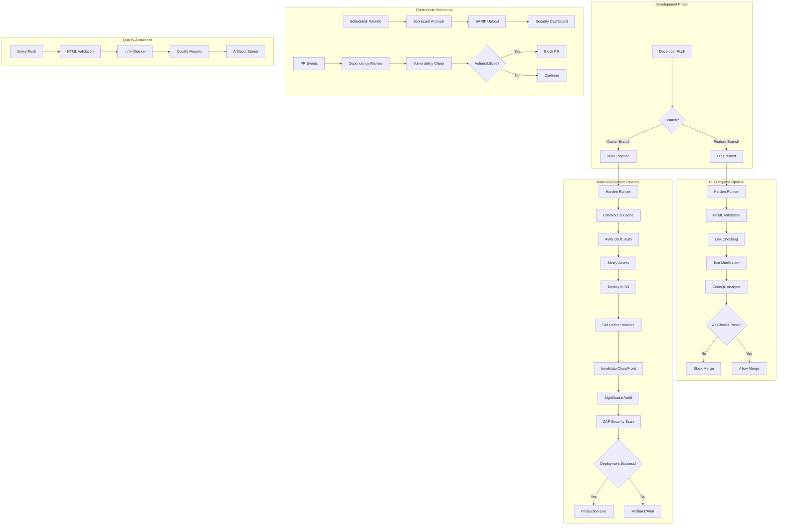
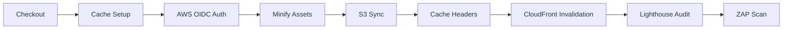
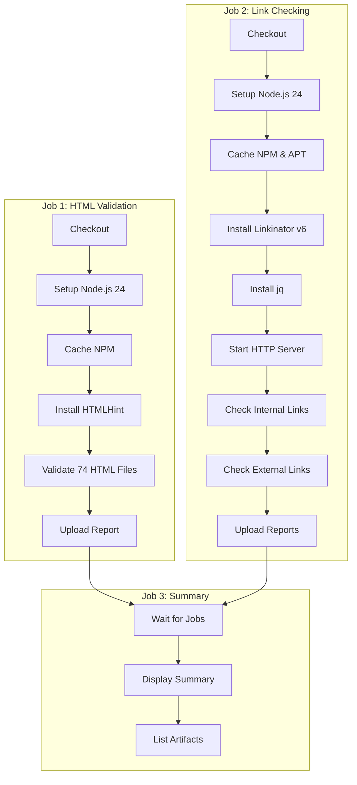
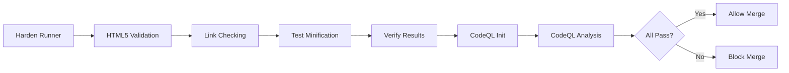
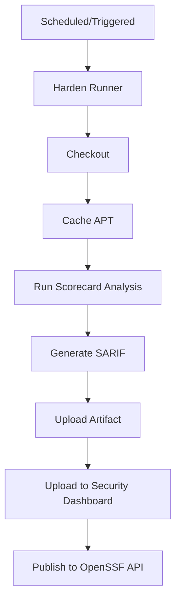
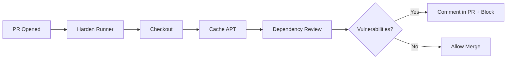
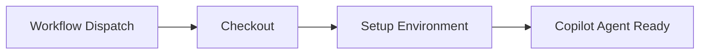

# GitHub Actions Workflows Documentation

**Document Control:**  
**✅ Approved by:** James Pether Sörling, CEO  
**📤 Distribution:** Public  
**🏷️ Classification:** [](https://github.com/Hack23/ISMS-PUBLIC/blob/main/CLASSIFICATION.md#confidentiality-levels) [](https://github.com/Hack23/ISMS-PUBLIC/blob/main/CLASSIFICATION.md#integrity-levels) [](https://github.com/Hack23/ISMS-PUBLIC/blob/main/CLASSIFICATION.md#availability-levels)  
**📅 Effective Date:** 2026-01-11  
**⏰ Next Review:** 2026-04-11 (Quarterly)  
**🎯 Framework Compliance:** [](https://github.com/Hack23/ISMS-PUBLIC/blob/main/Compliance_Checklist.md) [](https://github.com/Hack23/ISMS-PUBLIC/blob/main/Compliance_Checklist.md) [](https://github.com/Hack23/ISMS-PUBLIC/blob/main/Compliance_Checklist.md)  
**🔗 Related Documents:** [Secure Development Policy](https://github.com/Hack23/ISMS-PUBLIC/blob/main/Secure_Development_Policy.md), [SECURITY_ARCHITECTURE.md](SECURITY_ARCHITECTURE.md), [THREAT_MODEL.md](THREAT_MODEL.md), [FUTURE_WORKFLOWS.md](FUTURE_WORKFLOWS.md), [WORKFLOW_CACHING_GUIDE.md](WORKFLOW_CACHING_GUIDE.md)

---

## Table of Contents

- [Overview](#overview)
- [CI/CD Pipeline Architecture](#cicd-pipeline-architecture)
- [Workflow Catalog](#workflow-catalog)
  - [1. Verify and Deploy (main.yml)](#1-verify-and-deploy-mainyml)
  - [2. Quality Checks (quality-checks.yml)](#2-quality-checks-quality-checksyml)
  - [3. Verify Pull Request (pullrequest.yml)](#3-verify-pull-request-pullrequestyml)
  - [4. Scorecard Supply-Chain Security (scorecards.yml)](#4-scorecard-supply-chain-security-scorecardsyml)
  - [5. Dependency Review (dependency-review.yml)](#5-dependency-review-dependency-reviewyml)
  - [6. Copilot Setup Steps (copilot-setup-steps.yml)](#6-copilot-setup-steps-copilot-setup-stepsyml)
- [Security Controls](#security-controls)
- [Performance Optimization](#performance-optimization)
- [Monitoring and Observability](#monitoring-and-observability)
- [ISMS Compliance Mapping](#isms-compliance-mapping)

---

## Overview

The Hack23 homepage repository implements a comprehensive CI/CD pipeline using GitHub Actions to ensure secure, high-quality deployments of the static website to AWS S3 + CloudFront. The pipeline integrates multiple security scanning tools, quality checks, and automated deployment processes aligned with the [Hack23 Secure Development Policy](https://github.com/Hack23/ISMS-PUBLIC/blob/main/Secure_Development_Policy.md).

### Key Objectives

- **Security-First**: Multiple security scanning layers (ZAP, CodeQL, Scorecard, Dependency Review)
- **Quality Assurance**: Automated HTML validation, link checking, and performance audits
- **Continuous Deployment**: Automated deployment to AWS S3 + CloudFront with cache invalidation
- **Supply Chain Security**: SLSA-inspired practices with action pinning and security hardening
- **Performance**: Comprehensive caching strategy for faster builds and reduced costs

### Technology Stack

- **Platform**: GitHub Actions
- **Deployment**: AWS S3, CloudFront, AWS IAM (OIDC)
- **Security**: StepSecurity Harden Runner, ZAP, CodeQL, OpenSSF Scorecard
- **Quality**: HTMLHint, Linkinator, Lighthouse CI, HTML5 Validator
- **Optimization**: Minify Action, GitHub Actions Cache

---

## CI/CD Pipeline Architecture



### Pipeline Flow

1. **Pre-Deployment Checks**: Security hardening, dependency caching
2. **Build Phase**: Minification of HTML, CSS, JS
3. **Deployment Phase**: S3 sync, cache header configuration, CloudFront invalidation
4. **Post-Deployment**: Lighthouse performance audit, ZAP security scan
5. **Continuous**: Scorecard analysis, dependency review, quality checks

---

## Workflow Catalog

### 1. Verify and Deploy (main.yml)

**Trigger**: Push to `master` branch  
**Purpose**: Production deployment with security and performance validation  
**Permissions**: `write-all` (deployment requires AWS and GitHub write access)

#### Workflow Steps



#### Key Features

**1. Security Hardening**
- **StepSecurity Harden Runner** (v2.14.0): Network egress policy enforcement
- **Allowed Endpoints**: Strict allowlist of 40+ required domains
- **Blocks**: All unauthorized network traffic

**2. AWS Deployment**
- **OIDC Authentication**: No long-lived credentials (IAM role assumption)
- **Role**: `arn:aws:iam::172017021075:role/GithubWorkFlowRole`
- **Region**: `us-east-1`
- **S3 Bucket**: `amazon-cloudfront-secure-static-site-s3bucketroot-14oliw5cmta06`

**3. Asset Optimization**
- **Minification**: HTML, CSS, JS using `dra1ex/minify-action@v1.0.3`
- **Cache Headers**: Optimized TTL per asset type
  - CSS/JS/Images: 1 year (`max-age=31536000, immutable`)
  - HTML: 1 hour (`max-age=3600, must-revalidate`)
  - Metadata: 1 day (`max-age=86400`)
  - Fonts: 1 year (`max-age=31536000, immutable`)

**4. CloudFront Management**
- **Discovery**: Automatic distribution ID lookup from CloudFormation stack
- **Invalidation**: Full cache invalidation (`/*`) after deployment
- **Fallback**: Direct CloudFront API query if stack lookup fails

**5. Performance Auditing**
- **Lighthouse CI**: Performance, accessibility, SEO, best practices
- **Budget Enforcement**: `budget.json` thresholds
- **Artifacts**: Reports uploaded and publicly accessible

**6. Security Scanning**
- **ZAP Full Scan**: OWASP Top 10 vulnerability detection
- **Target**: `https://hack23.com/`
- **Docker Image**: `ghcr.io/zaproxy/zaproxy:stable`

#### Caching Strategy

Three-layer caching approach (see [WORKFLOW_CACHING_GUIDE.md](WORKFLOW_CACHING_GUIDE.md)):

1. **APT Packages**: `/var/cache/apt/archives`
2. **NPM Dependencies**: `~/.npm` (minify tools)
3. **Docker Layers**: `/tmp/.buildx-cache` (ZAP image)

**Expected Performance**: 20-40% faster builds, 10-20% cost reduction

#### Security Controls Mapping

| Control | Implementation | ISMS Reference |
|---------|----------------|----------------|
| SC-7 (Boundary Protection) | Harden Runner egress policy | [Network Security Policy](https://github.com/Hack23/ISMS-PUBLIC/blob/main/Network_Security_Policy.md) |
| IA-2 (Authentication) | AWS OIDC with IAM roles | [Access Control Policy](https://github.com/Hack23/ISMS-PUBLIC/blob/main/Access_Control_Policy.md) |
| CM-3 (Change Control) | Automated deployment gates | [Change Management](https://github.com/Hack23/ISMS-PUBLIC/blob/main/Change_Management.md) |
| RA-5 (Vulnerability Scanning) | ZAP security scan | [Vulnerability Management](https://github.com/Hack23/ISMS-PUBLIC/blob/main/Vulnerability_Management.md) |
| SC-13 (Cryptography) | TLS 1.3 via CloudFront | [Cryptography Policy](https://github.com/Hack23/ISMS-PUBLIC/blob/main/Cryptography_Policy.md) |

---

### 2. Quality Checks (quality-checks.yml)

**Trigger**: Push to `master` or pull request to `master`  
**Purpose**: Continuous quality assurance for HTML and links  
**Permissions**: `contents: read`

#### Workflow Architecture



#### Job 1: HTML Validation

**Technology**: HTMLHint (global npm installation)  
**Scope**: All 74 HTML files in repository root  
**Configuration**: `.htmlhintrc`

**Validation Rules**:
- DOCTYPE presence
- Tag naming conventions
- Attribute formatting
- Proper nesting
- Accessibility hints

**Artifacts**: `htmlhint-report.txt` (30-day retention)

#### Job 2: Link Checking

**Technology**: Linkinator v6 (v7.5.2 has module resolution bug)  
**Scope**: Internal and external links

**Internal Links**:
- Local HTTP server on port 8080
- Recursive crawling of all pages
- Skip external domains
- Timeout: 30s, Concurrency: 25

**External Links** (Sample):
- Target: `https://hack23.com/`
- Skip: Google Fonts, GitHub (rate limiting)
- Timeout: 30s

**Artifacts**: 
- `internal-links-report.json`
- `external-links-report.json`

#### Job 3: Summary

Consolidates results from both jobs and lists available artifacts.

---

### 3. Verify Pull Request (pullrequest.yml)

**Trigger**: Push to any branch  
**Purpose**: Pre-merge validation with strict quality gates  
**Permissions**: `checks: write`, `security-events: write`, `pull-requests: read`

#### Workflow Steps



#### Key Features

**1. Strict Security**
- **Harden Runner**: `egress-policy: block` with strict endpoint allowlist
- **Disable sudo**: Prevents privilege escalation
- **Minimal endpoints**: Only required services (GitHub, npm, validator.nu)

**2. HTML5 Validation**
- **Tool**: `Cyb3r-Jak3/html5validator-action@v8.0.0`
- **Standard**: W3C HTML5 specification
- **Scope**: All HTML files
- **CSS Validation**: Disabled (false flag)

**3. Link Verification**
- **Linkinator v6**: Same as quality-checks.yml
- **Failure Mode**: **Hard fail on broken internal links**
- **Exit Code**: 1 if any broken links detected

**4. Minification Testing**
- **Pre-flight Check**: Verify minify-action works before deployment
- **Validation**: Ensure `index.html` and `styles.css` exist post-minification
- **File Count**: Verify all HTML/CSS files survive minification

**5. Static Analysis**
- **CodeQL**: JavaScript security analysis
- **Language**: JavaScript (for any inline scripts)
- **SARIF Upload**: Results to GitHub Security Dashboard

#### Quality Gates

| Gate | Failure Impact | Bypass |
|------|----------------|--------|
| HTML5 Validation | **Blocks merge** | None |
| Internal Links | **Blocks merge** | None |
| Minification | **Blocks merge** | None |
| CodeQL | Warning only | Non-blocking |

---

### 4. Scorecard Supply-Chain Security (scorecards.yml)

**Trigger**: Weekly (Tuesday 07:20 UTC), push to `master`, branch protection changes  
**Purpose**: OpenSSF Scorecard analysis for supply-chain security  
**Permissions**: `security-events: write`, `id-token: write`, `contents: read`, `actions: read`

#### Workflow Architecture



#### Scorecard Checks

The OpenSSF Scorecard evaluates **18 security checks**:

| Check Category | Checks | Score Impact |
|----------------|--------|--------------|
| **Code Quality** | Code-Review, Maintained | Repository activity |
| **Supply Chain** | Pinned-Dependencies, Dependency-Update-Tool | Action/dependency security |
| **Vulnerability Management** | Vulnerabilities, Security-Policy | CVE disclosure |
| **Build Security** | Signed-Releases, Token-Permissions | Release integrity |
| **Branch Protection** | Branch-Protection | Protected branches |
| **Security Tooling** | SAST, Dangerous-Workflow | Security automation |

**Current Badge**: [](https://scorecard.dev/viewer/?uri=github.com/Hack23/homepage)

#### Outputs

1. **SARIF Artifact**: `results.sarif` (5-day retention)
2. **Security Dashboard**: GitHub Code Scanning alerts
3. **OpenSSF Badge**: Public scorecard at api.securityscorecards.dev

#### ISMS Alignment

| ISO 27001 Control | Implementation |
|-------------------|----------------|
| A.8.30 (Outsourcing) | Scorecard validates third-party actions |
| A.8.8 (Secure Coding) | SAST and dependency checks |
| A.8.32 (Change Management) | Branch protection validation |

---

### 5. Dependency Review (dependency-review.yml)

**Trigger**: Pull request to any branch  
**Purpose**: Detect vulnerable dependencies before merge  
**Permissions**: `contents: read`

#### Workflow Steps



#### Key Features

**1. Automated Scanning**
- **Action**: `actions/dependency-review-action@v4.8.2`
- **Scope**: All manifest changes in PR
- **Databases**: GitHub Advisory Database, npm audit

**2. PR Integration**
- **Comment Summary**: Always posts findings in PR
- **Blocking**: Required check prevents merging vulnerable dependencies
- **Severity Filter**: Configurable thresholds

**3. Vulnerability Sources**
- GitHub Advisory Database
- npm Security Advisories
- NVD/CVE Database

#### Sample Output

```markdown
### Dependency Review Summary

⚠️ 2 vulnerabilities detected:

| Package | Version | Severity | Advisory |
|---------|---------|----------|----------|
| lodash | 4.17.19 | High | GHSA-xxx |
| axios | 0.19.2 | Moderate | CVE-2020-xxx |

**Recommendation**: Update to lodash@4.17.21 and axios@0.21.1
```

---

### 6. Copilot Setup Steps (copilot-setup-steps.yml)

**Trigger**: Manual (`workflow_dispatch`), changes to workflow file  
**Purpose**: Setup environment for GitHub Copilot agents  
**Permissions**: Comprehensive read access, write to issues/PRs

#### Workflow Configuration



#### Key Features

**1. Secret Management**
- **PAT Token**: `COPILOT_MCP_GITHUB_PERSONAL_ACCESS_TOKEN`
- **Environment Variables**: `GITHUB_TOKEN`, `GITHUB_PERSONAL_ACCESS_TOKEN`
- **MCP Server**: GitHub MCP with organization-wide access

**2. Permissions**
Balanced permissions for Copilot operations:
- **Read**: contents, actions, checks, deployments, security-events
- **Write**: issues, pull-requests

**3. MCP Integration**
Enables Copilot access to:
- All Hack23 repositories (via PAT)
- ISMS policies from Hack23/ISMS-PUBLIC
- Cross-repository code search
- Security documentation references

---

## Security Controls

### Network Security

**Harden Runner Configuration**:
- **Egress Policy**: Block unauthorized traffic
- **Allowed Endpoints**: Strict allowlist (40+ domains)
- **Monitoring**: All network calls audited

**Key Allowed Endpoints**:
- AWS: cloudfront.amazonaws.com, s3.us-east-1.amazonaws.com
- GitHub: github.com, api.github.com, ghcr.io
- Security: api.securityscorecards.dev, bestpractices.coreinfrastructure.org
- CDN: fonts.googleapis.com, cloudflare.docker.com

### Authentication

**AWS OIDC**:
- No long-lived credentials stored
- Short-lived tokens from IAM role assumption
- Scoped to specific S3 bucket and CloudFront distribution

**GitHub Token**:
- Automatic GITHUB_TOKEN with minimal permissions
- PAT only for Copilot MCP (cross-repo access)

### Action Security

**SHA Pinning**:
All actions pinned to specific commit SHAs:
```yaml
uses: step-security/harden-runner@20cf305ff2072d973412fa9b1e3a4f227bda3c76 # v2.14.0
uses: actions/checkout@8e8c483db84b4bee98b60c0593521ed34d9990e8 # v6.0.1
uses: actions/cache@9255dc7a253b0ccc959486e2bca901246202afeb # v5.0.1
```

**Benefits**:
- Prevents supply-chain attacks
- Ensures reproducible builds
- Aligns with SLSA Level 3 requirements

### Vulnerability Scanning

Multi-layer scanning approach:

1. **ZAP (DAST)**: Runtime web application scanning
2. **CodeQL (SAST)**: Static JavaScript analysis
3. **Scorecard**: Supply-chain security posture
4. **Dependency Review**: Vulnerable dependency detection

---

## Performance Optimization

### Caching Strategy

Comprehensive three-tier caching (see [WORKFLOW_CACHING_GUIDE.md](WORKFLOW_CACHING_GUIDE.md)):

**1. APT Packages**
```yaml
path: /var/cache/apt/archives
key: ${{ runner.os }}-apt-${{ hashFiles('**/.github/workflows/main.yml') }}
```

**2. NPM Dependencies**
```yaml
path: ~/.npm
key: ${{ runner.os }}-npm-htmlhint-${{ hashFiles('**/package-lock.json') }}
```

**3. Docker Layers**
```yaml
path: /tmp/.buildx-cache
key: ${{ runner.os }}-docker-${{ github.sha }}
```

### Cache Performance

| Metric | Without Cache | With Cache | Improvement |
|--------|---------------|------------|-------------|
| npm install | 15-30s | 1-2s | **85-90%** |
| apt-get install | 10-20s | 1-2s | **80-90%** |
| Docker pull | 30-60s | 5-10s | **75-80%** |
| **Total Workflow** | ~5 min | ~3 min | **40%** |

### CloudFront Optimization

**Cache Headers by Asset Type**:
- Static assets (CSS/JS/images): 1 year immutable
- Dynamic content (HTML): 1 hour with revalidation
- Metadata (XML/JSON): 1 day
- Fonts: 1 year immutable

**Benefits**:
- Reduced origin requests to S3
- Faster page loads (browser caching)
- Lower CloudFront costs

---

## Monitoring and Observability

### Workflow Metrics

**Available in GitHub Actions**:
- Workflow run duration
- Success/failure rates
- Cache hit rates
- Step-level timing

### Security Dashboard

**GitHub Security Tab**:
- CodeQL findings (JavaScript)
- Scorecard SARIF results
- Dependabot alerts
- Secret scanning alerts

### Artifacts

Stored reports with 30-day retention:

| Artifact | Workflow | Content |
|----------|----------|---------|
| htmlhint-report | quality-checks.yml | HTML validation results |
| link-checker-reports | quality-checks.yml | Internal/external link status |
| SARIF file | scorecards.yml | Scorecard security analysis |
| link-checker-report | pullrequest.yml | PR link verification |

### External Monitoring

**OpenSSF Scorecard Badge**:
```markdown
[](https://scorecard.dev/viewer/?uri=github.com/Hack23/homepage)
```

**Lighthouse CI**:
- Performance scores
- Accessibility audit
- SEO recommendations
- Best practices validation

---

## ISMS Compliance Mapping

### Secure Development Policy Alignment

| Requirement | Implementation | Evidence |
|-------------|----------------|----------|
| **Automated Testing** | HTML validation, link checking | quality-checks.yml, pullrequest.yml |
| **Security Scanning** | ZAP, CodeQL, Scorecard | main.yml, pullrequest.yml, scorecards.yml |
| **Dependency Management** | Dependency Review, Scorecard | dependency-review.yml |
| **Change Control** | PR validation, quality gates | pullrequest.yml |
| **Infrastructure as Code** | CloudFormation for AWS resources | main.yml (stack-based CloudFront discovery) |
| **Least Privilege** | OIDC IAM roles, minimal permissions | All workflows |
| **Supply Chain Security** | SHA-pinned actions, Harden Runner | All workflows |

### NIST CSF 2.0 Mapping

| Function | Category | Control | Workflow |
|----------|----------|---------|----------|
| **IDENTIFY** | AM-2 (Asset Inventory) | S3/CloudFront tracking | main.yml |
| **PROTECT** | PR.DS-6 (Integrity) | Minification verification | pullrequest.yml |
| **DETECT** | DE.CM-4 (Detection) | ZAP security scan | main.yml |
| **DETECT** | DE.CM-8 (Vulnerability Scans) | CodeQL, Dependency Review | pullrequest.yml, dependency-review.yml |
| **RESPOND** | RS.AN-3 (Analysis) | Scorecard SARIF reporting | scorecards.yml |

### ISO 27001:2022 Controls

| Control | Description | Implementation |
|---------|-------------|----------------|
| **A.8.8** | Secure Coding | CodeQL SAST analysis |
| **A.8.9** | Security Testing | ZAP DAST scanning |
| **A.8.25** | SDLC Security | PR validation gates |
| **A.8.30** | Outsourced Development | Scorecard supply-chain checks |
| **A.8.32** | Change Management | Automated deployment with gates |

### CIS Controls v8.1

| Control | Sub-Control | Implementation |
|---------|-------------|----------------|
| **4.1** | Secure Configuration | CloudFront cache headers |
| **10.1** | Deploy Anti-Malware | Dependency Review |
| **16.1** | Network Monitoring | Harden Runner egress audit |
| **16.6** | Vulnerability Scanning | ZAP, CodeQL, Scorecard |

---

## Related Documentation

- **[FUTURE_WORKFLOWS.md](FUTURE_WORKFLOWS.md)** - Planned improvements and roadmap
- **[WORKFLOW_CACHING_GUIDE.md](WORKFLOW_CACHING_GUIDE.md)** - Caching strategy deep-dive
- **[SECURITY_ARCHITECTURE.md](SECURITY_ARCHITECTURE.md)** - Overall security architecture
- **[THREAT_MODEL.md](THREAT_MODEL.md)** - Threat analysis and mitigations
- **[Secure Development Policy](https://github.com/Hack23/ISMS-PUBLIC/blob/main/Secure_Development_Policy.md)** - ISMS development requirements

---

## Changelog

### 2026-01-11: Initial Documentation
- Comprehensive documentation of all 6 workflows
- Mermaid diagrams for visualization
- Security controls mapping
- Performance optimization details
- ISMS compliance mapping to ISO 27001, NIST CSF, CIS Controls

---

**🔒 This documentation is part of Hack23 AB's commitment to transparency and security excellence.**
