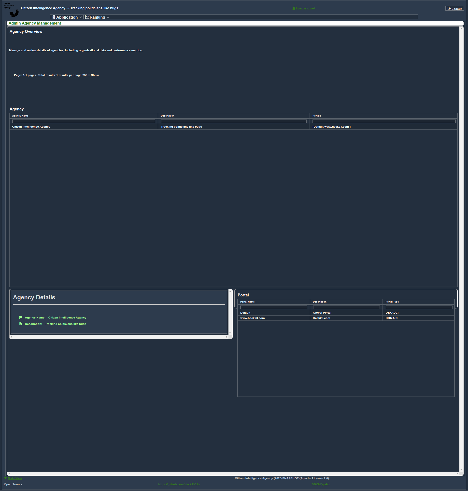
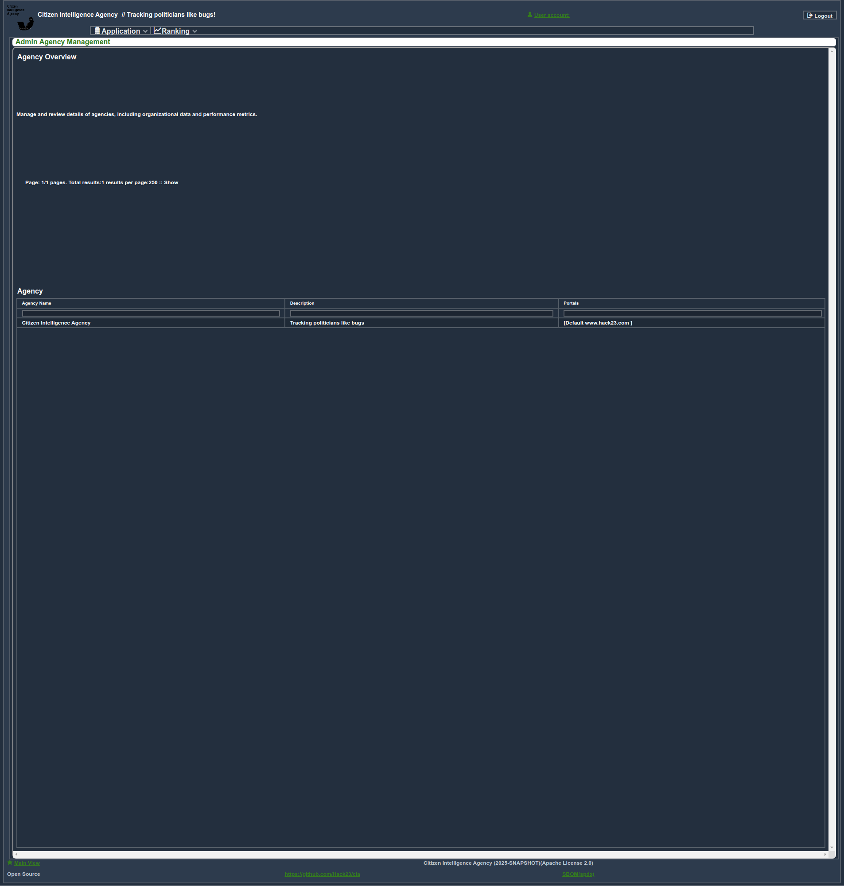
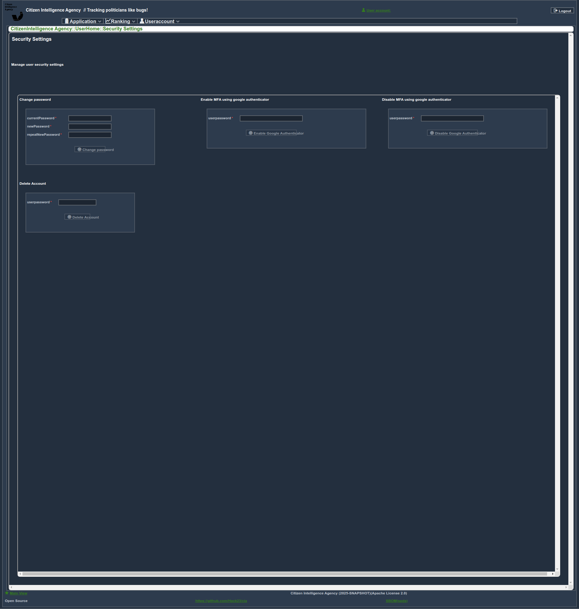

Here is the updated complete page with the revised **Table of Contents**, placing **User Home and Personal Dashboards** at the end and making all adjustments for better flow and presentation:

---

# **Screenshots of the CIA Project**

This document showcases the primary features of the [Citizen Intelligence Agency (CIA) project](https://github.com/Hack23/cia). These screenshots illustrate high-level dashboards, critical scoreboards, and detailed analytics, focusing on transparency, accountability, and decision-making in Sweden’s political landscape.

---

## **Table of Contents**

1. [Dashboard and Scoreboard Views](#dashboard-and-scoreboard-views)  
2. [Ministry Leaders and Insights](#ministry-leaders-and-insights)  
3. [Government Body Insights](#government-body-insights)  
4. [Party and Parliament Insights](#party-and-parliament-insights)  
5. [Decision Flow and Risk Assessments](#decision-flow-and-risk-assessments)  
6. [Committee Views](#committee-views)  
7. [Country Rankings and Analysis](#country-rankings-and-analysis)  
8. [Politician Profiles and Analytics](#politician-profiles-and-analytics)  
9. [Administrative Agency Views](#administrative-agency-views)  
10. [Agent Operation Views](#agent-operation-views)  
11. [User Home and Personal Dashboards](#user-home-and-personal-dashboards)  

---

## **Dashboard and Scoreboard Views**

### **Central Monitoring Dashboard**  
This real-time monitoring dashboard offers visualizations of political activities, legislative decisions, and operational trends. It acts as a centralized hub for analysis.  

### **Ministry Leadership Scorecard**  
A detailed evaluation of current ministry leaders focusing on efficiency, impact, and governance outcomes. This scorecard identifies top-performing leaders and opportunities for improvement.  

### **Parliament Rankings Overview**  
An overview of parliamentary activities and rankings, highlighting key legislative performance metrics and enabling comparative insights.  

---

## **Ministry Leaders and Insights**

### **Leadership and Financial Metrics**  
Insights into current ministry leadership, responsibilities, and financial resource allocation:  

- **Leadership Overview**: Highlights affiliations and governance roles.  
    

- **Expenditure and Revenue**: Explores financial prioritization and funding sources.  
    
    

- **Headcount Rankings**: Ranks ministries based on staffing levels for comparative analysis.  
    

---

## **Government Body Insights**

### **Roles, Income, and Accountability**  
Detailed insights into government body structures, funding, and operational responsibilities:  

- **Government Body Overview**  
    

- **Income Analysis**  
    

---

## **Party and Parliament Insights**

### **Political Party Profiles**  
An in-depth summary of a major political party's leadership structure and parliamentary dynamics.  

  

### **Membership History**  
A historical overview of party membership trends, illustrating shifts in political alignment.  

  

---

## **Decision Flow and Risk Assessments**

### **Parliamentary Risk Summary**  
Evaluation of potential risks linked to parliamentary activities, promoting governance transparency and accountability.  

  

---

## **Committee Views**

### **Ballot Decision Summaries**  
Transparent insights into key committee ballot decisions, offering trends in legislative actions.  

  

### **Decision-Making Flows**  
A visual map of committee decision processes during the 2016-17 period, highlighting legislative pathways.  

  

---

## **Country Rankings and Analysis**

### **IT Security Indicators**  
An analysis of Sweden’s IT security metrics, emphasizing its readiness to counter digital threats and infrastructure resilience.  

  

### **Global Governance Rankings**  
Sweden’s ranking across governance quality, transparency, and economic indicators, compared globally.  

  

---

## **Politician Profiles and Analytics**

### **Legislative Contributions and Roles**  
A detailed profile of a parliament member, including voting patterns and decision-making impact.  

  

### **Role Gantt Chart**  
A timeline of a politician’s roles and responsibilities, visualized for career trajectory insights.  

  

---

## **Administrative Agency Views**

### **Agency Operations Overview**  
An interface showcasing administrative agency performance, management efficiency, and specific operational insights.  

  
  

---

## **Agent Operation Views**

### **Operational Efficiency and Workflows**  
A detailed view of agent activities, focusing on key performance indicators, workload management, and operational distribution.  

  

---

## **User Home and Personal Dashboards**

### **Personalized Dashboard**  
An interactive user dashboard summarizing recent activities and providing quick access to key features.  

  

### **Security Settings and Visit Logs**  
Tools to manage account security and track user interactions for enhanced safety and transparency.  

  
  

---

## **Additional Information**

For more details about the Citizen Intelligence Agency project, visit:

- [GitHub Repository](https://github.com/Hack23/cia)  
- [Official Hack23 Website](https://hack23.com/)  

The CIA project leverages advanced analytics and visualizations to enhance understanding and promote informed decisions in Sweden’s political ecosystem. These screenshots offer a high-level overview of its features, underlining its commitment to transparency and accountability.  

---
