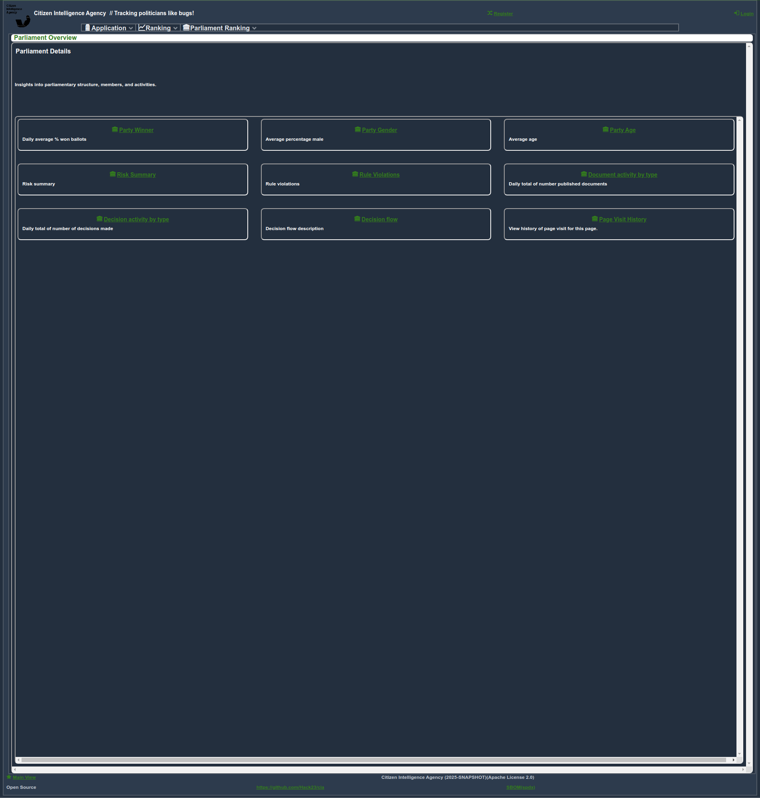
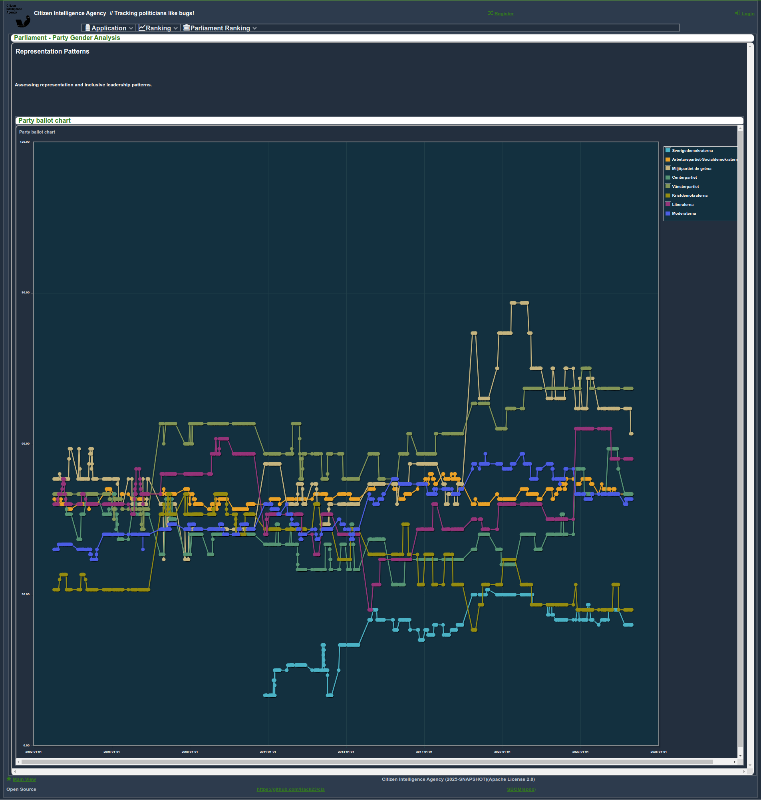
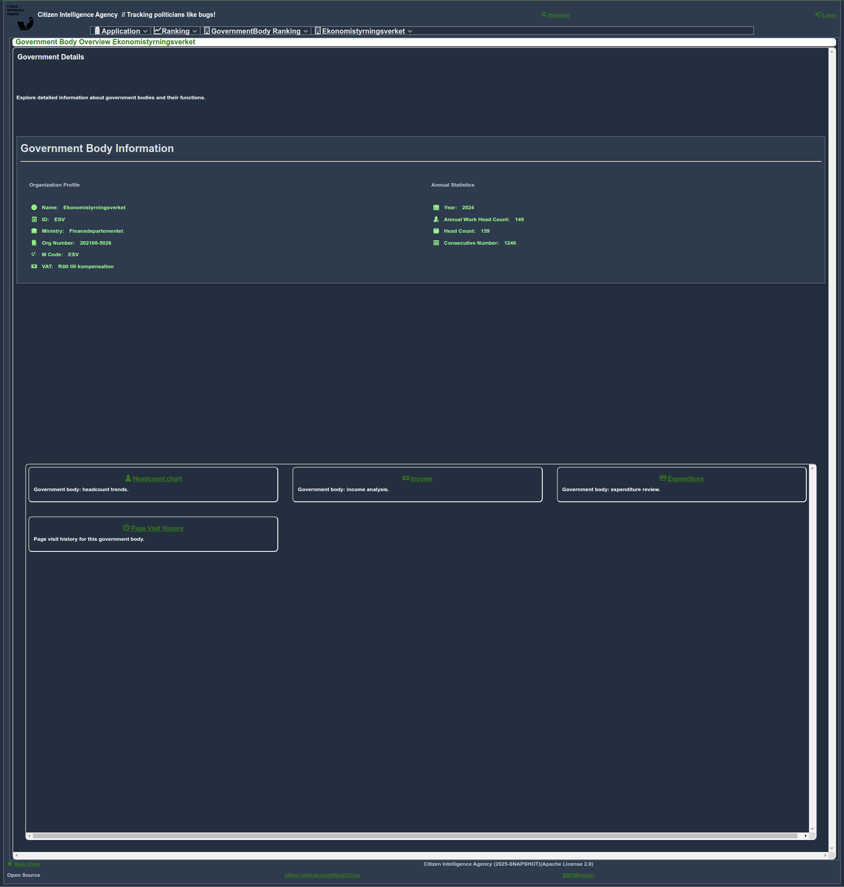
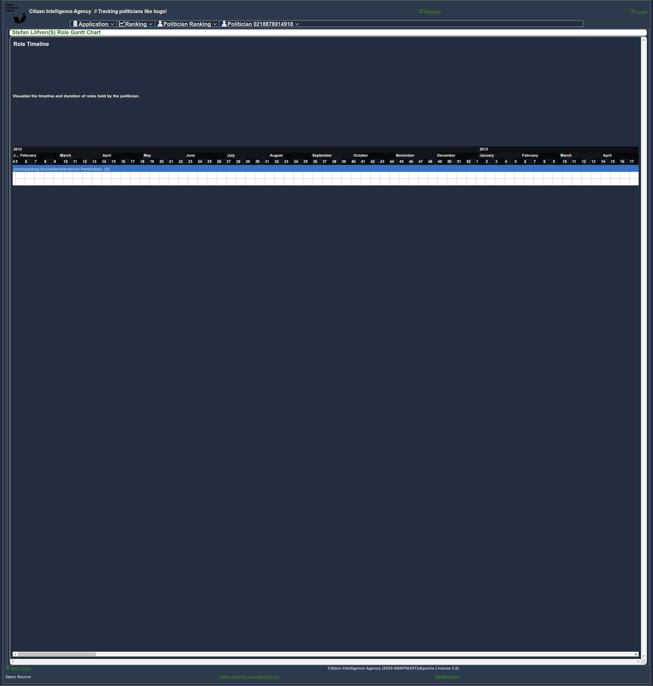

# Screenshots of the CIA Project

This document showcases various features of the [Citizen Intelligence Agency (CIA) project](https://github.com/Hack23/cia) through screenshots. The screenshots emphasize key dashboard views, high-level scoreboards, and other critical interfaces designed to enhance transparency, accountability, and decision-making in the political landscape.

---

## Table of Contents

1. [Dashboard and Scoreboard Views](#dashboard-and-scoreboard-views)
2. [Administrative Agency Views](#administrative-agency-views)
3. [Agent Operation Views](#agent-operation-views)
4. [Committee Views](#committee-views)
5. [Country Rankings and Analysis](#country-rankings-and-analysis)
6. [Party and Parliament Insights](#party-and-parliament-insights)
7. [Government Body Insights](#government-body-insights)
8. [Politician Profiles and Analytics](#politician-profiles-and-analytics)
9. [Decision Flow and Risk Assessments](#decision-flow-and-risk-assessments)
10. [User Home and Personal Dashboards](#user-home-and-personal-dashboards)

---

## Dashboard and Scoreboard Views

**Page-dashboard-OVERVIEW-331.png**  
A comprehensive monitoring dashboard showcasing real-time visualizations of political activities, decisions, and their impact. It serves as the central hub for analyzing trends and operational efficiency.

### **Ministry Leadership Scorecard**

**Current Ministry Leadership Evaluation**  
This chart provides a detailed evaluation of current ministry leaders, focusing on their efficiency, impact, and governance outcomes. The scorecard helps identify top-performing leaders and highlights areas for improvement within ministry governance.

---

This addition places emphasis on leadership metrics, aligning well with the overall goal of showcasing insights into governance quality. Let me know if you'd like further refinements or additional inclusions!

**Page-parliamentranking-OVERVIEW-166.png**  
An overview of parliamentary activities and rankings, highlighting legislative performance metrics across various categories. This view enables users to compare parliamentary entities effectively.

**Page-parliamentranking-CHARTS-PARTYGENDER-240.png**  
A gender analysis within political parties represented in parliament. This visualization highlights the gender composition of decision-making bodies, reflecting broader societal trends.

**Page-countryranking-OVERVIEW-329.png**  
A global ranking overview emphasizing Sweden's position on metrics such as governance quality, transparency, and economic performance.

---

### **Ministry Leaders and Insights**

**Ministry Leader Overview**  
Provides an analysis of current ministry leadership, highlighting responsibilities, affiliations, and overall influence within the government structure.

**Ministry Expenditure Analysis**  
A breakdown of government body expenditure under the ministry, offering insights into financial prioritization and resource allocation.

**Ministry Income Sources**  
Examines the revenue streams of government bodies overseen by the ministry, providing clarity on financial sustainability.

**Ministry Rankings by Headcount**  
Visualizes all ministries ranked by their headcount, offering a comparative view of ministry staffing.

---

## Administrative Agency Views

**Page-adminagency-52-70.png**  
A detailed interface presenting an overview of administrative agencies, providing insights into their performance and operational efficiency.

**Page-adminagency-69.png**  
A closer examination of agency-specific data, including performance metrics and management efficiency indicators.

---

## Agent Operation Views

**Page-adminagentoperation-87.png**  
An operational scoreboard showcasing agent activity metrics, highlighting key performance indicators and workflow distribution.

---

## Committee Views

**Page-committee-BALLOTDECISIONSUMMARY-UU-154.png**  
A summary of key ballot decisions within a legislative committee, providing transparency in voting outcomes and decision-making trends.

**Page-committee-CHARTS-DECISION_FLOW_CHART-UU[2016-17]-245.png**  
A visual map of decision-making flows within a committee, offering insights into legislative processes and their outcomes during the 2016-17 period.

---

## Country Rankings and Analysis

**Page-countryranking-INDICATORS-IT.NET.SECR.P6-149.png**  
Detailed IT security rankings for countries, reflecting their readiness to address digital threats and safeguard infrastructure.

---

## Party and Parliament Insights

**Page-party-OVERVIEW-S-181.png**  
An insightful summary of the political party "S", focusing on its parliamentary dynamics, leadership structure, and influence across legislative processes.

**Page-party-MEMBERHISTORY-S-100.png**  
A historical analysis of the party’s membership trends, providing context on changes in political alignment over time.

---

## Government Body Insights

**Page-governmentbody-OVERVIEW-202100-5026-244.png**  
An organizational snapshot of a government body, detailing its role in governance and its accountability metrics.

**Page-governmentbody-INCOME-202100-5026-131.png**  
A detailed analysis of income sources for government bodies, highlighting their funding and financial sustainability.

---

## Politician Profiles and Analytics

**Page-politician-0103624617217-151.png**  
A granular profile of a parliament member, focusing on their legislative contributions, decision-making patterns, and constituency representation.

**Page-politician-ROLEGHANT-0218878014918-113.png**  
A timeline of the politician’s roles and responsibilities, visualized as a Gantt chart, demonstrating their career trajectory and impact.

---

## Decision Flow and Risk Assessments

**Page-parliamentranking-RULES-RISK_SUMMARY-306.png**  
An evaluative summary of risk factors associated with parliamentary activities, designed to promote transparency and proactive governance.

---

## User Home and Personal Dashboards

**Page-userhome-108.png**  
A personalized user dashboard offering quick access to relevant features and an overview of recent activities.

**Page-userhome-SECURITY_SETTINGS--110.png**  
A dedicated interface for managing account security settings, empowering users to safeguard their data effectively.

**Page-userhome-USER_VISITS--202.png**  
A chronological log of user visits to various pages, enabling users to track their interactions within the platform.

---

## Additional Information

For more information about the Citizen Intelligence Agency project, visit:

- [Citizen Intelligence Agency on GitHub](https://github.com/Hack23/cia)
- [Official Hack23 Website](https://hack23.com/)

The CIA project employs advanced data visualization and analytics to deliver unparalleled insights into Sweden's political ecosystem, enhancing transparency and informed decision-making. These screenshots represent the platform’s most pivotal features, from dashboards to detailed risk assessments, demonstrating its commitment to empowering users with actionable intelligence.
